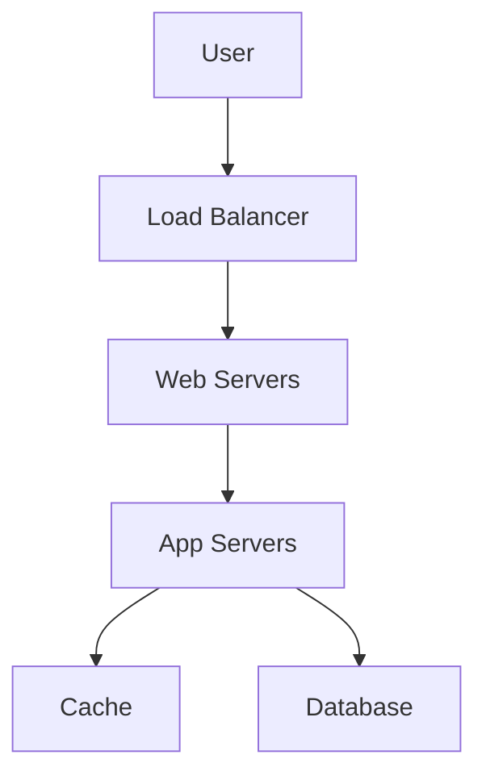

# 1.2 Framework for System Design Interviews

System design interviews are often open-ended and can be intimidating. Having a structured framework helps you navigate the discussion, ensure you cover all the important aspects, and effectively communicate your thought process to the interviewer.

## 1. Introduction

A framework is not a rigid script, but a guide to help you structure your thinking. It ensures you don't prematurely jump into detailed design without first understanding the problem's scope and requirements.

## 2. A 4-Step Framework for System Design Interviews

### Step 1: Understand the Problem and Establish Design Scope

This is the most critical step. A misunderstanding here can derail the entire interview.

*   **Ask Clarifying Questions:**
    *   What are the most important features?
    *   Who are the users?
    *   How many users do we expect?
    *   What is the expected read/write ratio?
    *   Is the system global? Does it need to be multi-lingual?
*   **Define Functional Requirements:** What the system should do.
    *   *Example:* "Users should be able to post tweets," "The timeline should show the most recent tweets from followed users."
*   **Define Non-Functional Requirements:** How the system should behave.
    *   *Example:* "The system should be highly available (99.99%)," "The timeline should load in under 200ms," "The system should be scalable to 100 million daily active users."
*   **Make Back-of-the-envelope Estimations:**
    *   **Traffic:** Estimate QPS (Queries Per Second) for read and write operations.
    *   **Storage:** Estimate the amount of data to be stored over a certain period (e.g., 5 years).
    *   **Bandwidth:** Estimate the network bandwidth requirements.

### Step 2: Propose a High-Level Design

With the requirements established, sketch out a high-level architectural diagram.

*   **Sketch the Main Components:** Identify the key services, databases, caches, load balancers, etc.
*   **Draw a Diagram:** Use the whiteboard or a drawing tool to create a simple block diagram showing how these components interact.
*   **Justify Your Choices:** Briefly explain why you chose certain components (e.g., "I'm using a NoSQL database here because the data is unstructured and we need horizontal scalability").

### Step 3: Dive Deep into Specific Components

The interviewer will likely guide you to focus on a particular part of your design.

*   **Choose a Component to Detail:** This could be:
    *   **API Design:** Define the API endpoints, request/response formats for a key service.
    *   **Database Schema:** Design the database tables or NoSQL document structure.
    *   **A Specific Algorithm:** Explain how a core piece of logic would work (e.g., the news feed generation algorithm).
*   **Discuss Trade-offs:** Every design choice has trade-offs. Discuss them openly (e.g., "By using a eventually consistent cache, we get better performance, but users might see stale data for a short period").
*   **Identify Bottlenecks:** Proactively identify potential bottlenecks in your design (e.g., "The database could become a bottleneck under heavy write load," "A single point of failure might exist here").

### Step 4: Wrap Up and Identify Further Improvements

In the final minutes, summarize your design and discuss potential future directions.

*   **Summarize the Design:** Briefly walk through your high-level architecture and key design decisions.
*   **Discuss Potential Future Improvements:**
    *   **Monitoring and Analytics:** How would you monitor the system's health and performance?
    *   **Security:** How would you handle authentication, authorization, and prevent common attacks?
    *   **Scaling Further:** What would you do if the system needed to scale 10x or 100x?
    *   **Cost Optimization:** How could you make the system more cost-effective?
*   **Mention Edge Cases:** Briefly touch upon any edge cases or assumptions you made during the design.

## Key Things to Remember

*   **Communicate Your Thought Process:** The journey is more important than the destination. Explain *why* you are making certain decisions.
*   **Drive the Conversation:** Be proactive. Guide the interviewer through your framework.
*   **There's No Single "Right" Answer:** The goal is to demonstrate your ability to think critically about a complex problem, not to produce a perfect, pre-canned solution.
