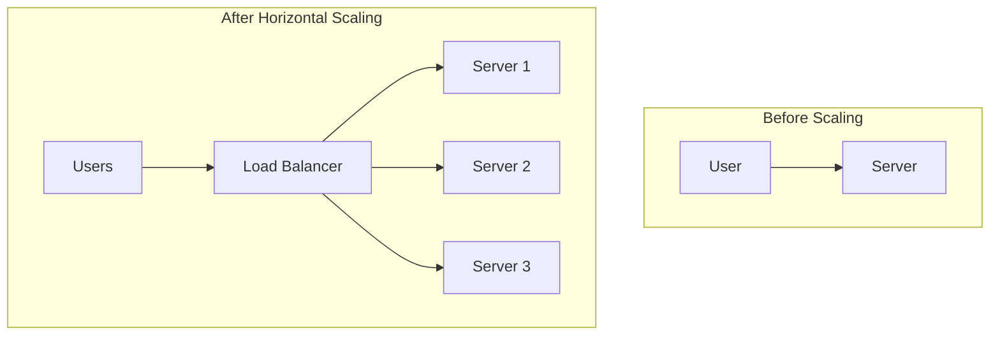

# 1.4 Scaling Applications

Scalability is a system's ability to handle a growing amount of work by adding resources. A scalable application can maintain performance and availability as user traffic, data volume, and complexity increase.

## 1. Introduction

When designing a system, it's crucial to plan for growth. An application that works for 1,000 users might fail completely at 1,000,000 users if not designed to scale. There are two primary ways to scale a system: vertical scaling and horizontal scaling.

## 2. Vertical Scaling (Scaling Up)

Vertical scaling involves increasing the resources of a single server. This means adding more CPU power, RAM, or faster storage (e.g., switching from HDD to SSD).

*   **Pros:**
    *   **Simplicity:** Often requires no changes to the application's code. It's as simple as upgrading the hardware.
    *   Easier to manage a single, powerful machine.
*   **Cons:**
    *   **Single Point of Failure:** If the single server goes down, the entire application is unavailable.
    *   **Hardware Limits:** There is a physical limit to how much you can upgrade a single machine.
    *   **Expensive:** High-end hardware can be very costly, with diminishing returns.

```mermaid
graph TD
    subgraph Before Scaling
        A[User] --> S1[Server (e.g., 4-core CPU, 16GB RAM)];
    end
    subgraph After Vertical Scaling
        B[User] --> S2[Upgraded Server (e.g., 16-core CPU, 64GB RAM)];
    end
```

## 3. Horizontal Scaling (Scaling Out)

Horizontal scaling involves adding more servers to your pool of resources and distributing the load among them. This is the foundation of modern, large-scale web applications.

*   **Pros:**
    *   **High Availability & Fault Tolerance:** If one server fails, others can take over its load.
    *   **Near-Infinite Scalability:** You can theoretically add an unlimited number of servers.
    *   **Cost-Effective:** Using commodity hardware is often cheaper than high-end single servers.
*   **Cons:**
    *   **Increased Complexity:** Requires additional components like load balancers and a way to manage distributed state.
    *   Requires careful architectural design to ensure services are stateless.



## 4. Key Components for Horizontal Scaling

To effectively scale horizontally, your architecture needs several key components:

### 4.1 Load Balancing

A load balancer sits in front of your servers and distributes incoming network traffic across them. This prevents any single server from becoming a bottleneck.

*   **Common Algorithms:**
    *   **Round Robin:** Distributes requests sequentially to each server.
    *   **Least Connections:** Sends the next request to the server with the fewest active connections.
    *   **IP Hash:** Ensures that requests from a specific user (IP address) are always sent to the same server, which can be useful for session persistence.

### 4.2 Stateless Services

For a load balancer to work effectively, your application servers must be **stateless**. This means they do not store any user-specific data (like session information) on their local disk or in memory. State should be externalized to a shared data store, such as a database or a distributed cache, that all servers can access.

### 4.3 Distributed Databases

As traffic grows, a single database can become a bottleneck.

*   **Replication:**
    *   **Master-Slave:** All writes go to a master database, which then replicates the data to one or more slave databases. Reads can be distributed across the slaves. This is a common pattern for read-heavy applications.
    *   **Master-Master:** Multiple master databases can accept writes, and they replicate data to each other. This is more complex to manage due to potential write conflicts.
*   **Sharding (Partitioning):**
    *   Involves splitting a large database into smaller, more manageable pieces called shards. Each shard contains a subset of the data (e.g., sharding users by their country or the first letter of their username).

### 4.4 Caching

A caching layer reduces latency and decreases the load on your database by storing frequently accessed data in a faster, in-memory store.

*   **Client-side Caching:** The browser itself caches assets.
*   **CDN (Content Delivery Network):** Caches static assets (images, CSS, JS) at edge locations closer to users.
*   **Server-side Cache:**
    *   **In-memory cache:** (e.g., Redis, Memcached). A separate service that provides a very fast key-value store.

### 4.5 Asynchronous Processing

Using message queues (e.g., RabbitMQ, Kafka) allows you to decouple services and handle time-consuming tasks asynchronously. For example, when a user uploads a video, the web server can add a "video processing" job to a queue and immediately return a response to the user. A separate fleet of worker services can then pull jobs from the queue and perform the actual video transcoding in the background. This prevents long-running tasks from blocking the main application threads.
