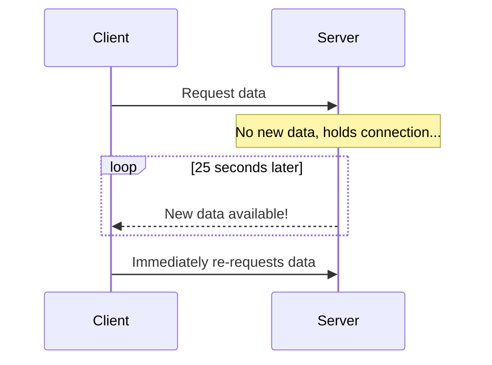
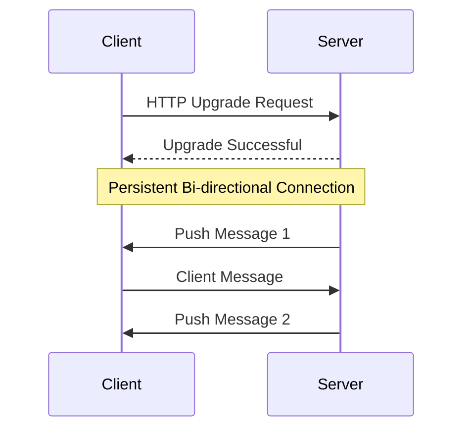

# 2.10 Long Polling vs. WebSockets vs. Server-Sent Events

In many modern web applications, it's necessary for the server to send data to the client without the client first making a request. This is crucial for real-time features like chat messages, notifications, and live data feeds. This document explores three common technologies used to achieve this: Long Polling, WebSockets, and Server-Sent Events (SSE).

## 1. Introduction

The traditional HTTP request-response model is initiated by the client. For a server to "push" data, several patterns have been developed to simulate or enable real-time, server-initiated communication.

## 2. Polling (Short Polling)

Before discussing the main three, it's useful to understand short polling.

*   **How it works:** The client repeatedly sends requests to the server at a fixed interval (e.g., every 2 seconds) to ask, "Do you have any new data for me?"
*   **Pros:** Very simple to implement.
*   **Cons:** Highly inefficient. It generates a lot of network traffic, most of which is for empty responses, and introduces a delay (latency) of at least the polling interval.

## 3. Long Polling

Long polling is a more efficient variation of polling.

*   **How it works:**
    1.  The client sends a request to the server.
    2.  The server holds the connection open, waiting for new data to become available.
    3.  When the server has new data, it sends the response to the client and closes the connection.
    4.  The client immediately opens a new connection to the server, and the process repeats.
*   **Pros:**
    *   More efficient than short polling as it eliminates empty responses.
    *   Lower latency, as data is sent as soon as it's available.
*   **Cons:**
    *   Can be resource-intensive on the server, as it has to keep many connections open.
    *   Can be complex to implement correctly (e.g., handling timeouts).

## 4. WebSockets

WebSockets provide a persistent, **bi-directional**, full-duplex communication channel over a single TCP connection.

*   **How it works:** The connection is initiated with an HTTP "Upgrade" request. Once established, the connection is upgraded from HTTP to the WebSocket protocol, which allows both the client and the server to send data to each other at any time without the overhead of HTTP headers.
*   **Pros:**
    *   **Bi-directional:** True two-way communication.
    *   **Very low latency:** Ideal for real-time applications.
    *   **Highly efficient:** After the initial handshake, data frames are small, reducing network overhead.
*   **Cons:**
    *   More complex to implement and manage than SSE or polling.
    *   Requires server-side support for the WebSocket protocol.
    *   Firewalls and proxies can sometimes interfere with WebSocket connections.

## 5. Server-Sent Events (SSE)

SSE is a standard that allows a server to push data to a client **unidirectionally** (from server to client) over a standard HTTP connection.

*   **How it works:** The client establishes a connection with the server, and the server keeps that connection open, sending data in a specific `text/event-stream` format whenever new data is available.
*   **Pros:**
    *   **Simple to implement:** Built on top of standard HTTP.
    *   **Automatic Reconnection:** Browsers automatically attempt to reconnect if the connection is lost.
    *   **Event-based:** Can send events with names and IDs.
*   **Cons:**
    *   **Unidirectional:** Only supports server-to-client communication. The client cannot send data to the server over the SSE connection (it would have to use a separate HTTP request).
    *   **Connection Limit:** Subject to browser limitations on the maximum number of open HTTP connections per domain.

## 6. Comparison Table

| Feature           | Long Polling                         | WebSockets                             | Server-Sent Events (SSE)          |
| :---------------- | :----------------------------------- | :------------------------------------- | :-------------------------------- |
| **Directionality**| Unidirectional (simulated push)      | **Bi-directional**                     | **Unidirectional** (server to client) |
| **Protocol**      | HTTP/1.1                             | WebSocket (ws://, wss://)              | HTTP/1.1                          |
| **Efficiency**    | Medium (overhead of new requests)    | High (low overhead after handshake)    | Medium (HTTP-based)               |
| **Complexity**    | Medium                               | High                                   | Low                               |
| **Reconnection**  | Manual implementation                | Manual implementation                  | **Automatic**                     |
| **Use Cases**     | Fallback for older browsers          | Chat, multiplayer games, collaborative editing | News feeds, stock tickers, notifications |

## 7. When to Use Which?

*   **Use Long Polling** as a fallback when WebSockets or SSE are not available or are blocked by a firewall.
*   **Use WebSockets** when you need true real-time, **bi-directional** communication. It's the best choice for chat applications, collaborative tools, and online gaming.
*   **Use Server-Sent Events (SSE)** when you need a simple way to **push data from the server to the client**. It's perfect for notifications, live news feeds, and any scenario where the client primarily listens for updates.
