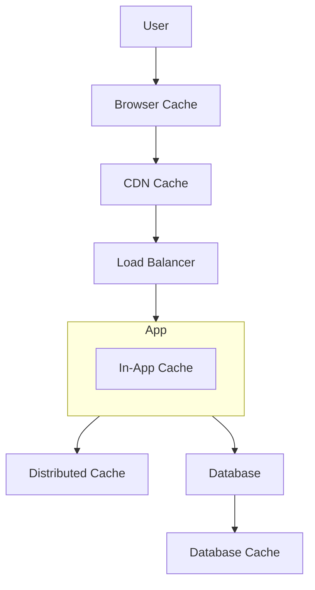
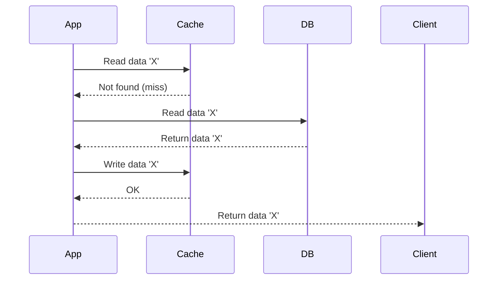

# 2.2 Caching

Caching is the process of storing copies of data in a temporary, high-speed storage layer (a cache) to serve future requests for that data more quickly. It is one of the most effective techniques for improving application performance and reducing the load on backend systems.

## 1. Introduction

The fundamental principle of caching is that accessing data from a faster, closer storage layer is significantly quicker than fetching it from a slower, more distant source. By caching frequently accessed data, you can dramatically reduce latency and decrease the number of requests hitting your database or other backend services.

## 2. Caching Layers

Caching can be implemented at various layers of an application's architecture.

*   **Client-Side Caching (Browser Cache):** The browser itself can cache resources like images, CSS, and JS files based on HTTP cache headers (`Cache-Control`, `Expires`).
*   **CDN (Content Delivery Network):** A CDN is a geographically distributed network of servers that caches static content (images, videos, HTML, CSS, JS) at edge locations closer to users. This reduces network latency.
*   **Server-Side Caching:**
    *   **Database Caching:** Most databases have an internal cache to store frequently accessed data and query plans in memory.
    *   **Application-Level Cache:** Data can be cached directly within the application's memory. This is fast but not shared across multiple application servers.
    *   **Distributed Cache:** A separate, external service that provides a shared, in-memory data store. This is the most common and powerful caching pattern for scalable applications. **Redis** and **Memcached** are popular examples.

## 3. Caching Strategies (Cache Writing/Reading Policies)

This defines *how* and *when* data is written to and read from the cache.

### 3.1 Cache-Aside (Lazy Loading)

This is the most common caching strategy.

1.  The application checks the cache for the data.
2.  **Cache Miss:** If the data is not in the cache, the application reads the data from the database, writes it to the cache, and then returns it.
3.  **Cache Hit:** If the data is in the cache, it's returned directly.

*   **Pros:** Resilient to cache failures (the app can still get data from the DB). Only data that is actually requested gets cached.
*   **Cons:** Higher latency on a cache miss (involves a cache check, DB read, and cache write). Data can become stale if it's updated in the DB but not in the cache.

### 3.2 Read-Through

The application treats the cache as its main data source. The cache itself is responsible for fetching data from the database on a cache miss.

*   **Pros:** Simplifies application code (the app only talks to the cache).
*   **Cons:** The cache provider must support this feature. Less flexible than cache-aside.

### 3.3 Write-Through

When the application writes data, it writes it to the cache, and the cache **synchronously** writes it to the database.

*   **Pros:** High data consistency between the cache and the database.
*   **Cons:** Higher write latency because the application has to wait for both the cache and the database writes to complete.

### 3.4 Write-Back (Write-Behind)

The application writes data to the cache, which acknowledges the write immediately. The cache then **asynchronously** writes the data to the database after a delay.

*   **Pros:** Extremely low write latency, as the application doesn't have to wait for the database write.
*   **Cons:** Higher risk of data loss if the cache fails before the data is persisted to the database.

### 3.5 Write-Around

Data is written directly to the database, bypassing the cache entirely. The cache is only populated on a subsequent read miss (using a cache-aside strategy).

*   **Pros:** Avoids flooding the cache with data that is written but not immediately read.
*   **Cons:** Can lead to cache inconsistency until the data is read and cached. A read request for recently written data will experience a cache miss.

## 4. Cache Eviction Policies

When the cache becomes full, we need a policy to decide which items to evict (remove).

*   **LRU (Least Recently Used):** Discards the item that has not been accessed for the longest time. This is a good general-purpose policy.
*   **LFU (Least Frequently Used):** Discards the item that has been accessed the fewest times.
*   **FIFO (First-In, First-Out):** Discards the oldest items first, regardless of how often or recently they were accessed.
*   **TTL (Time to Live):** Items are automatically evicted after a specified period. This is crucial for ensuring stale data doesn't live in the cache forever.
