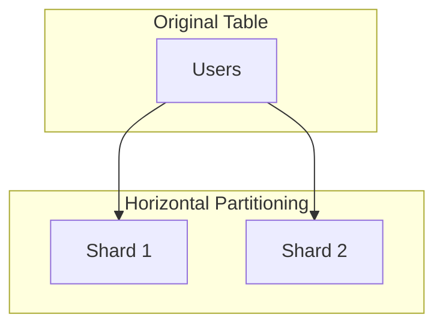
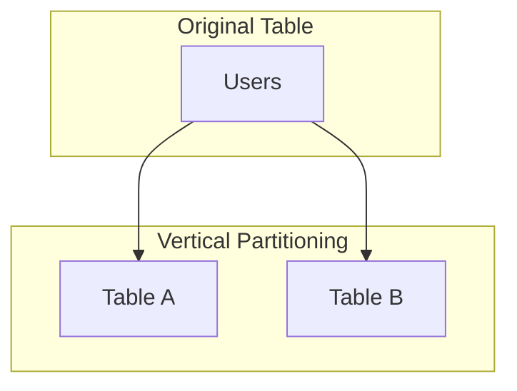

# 2.3 Data Partitioning (Sharding)

Data partitioning, often called sharding, is the process of splitting a large database into smaller, faster, more manageable parts called partitions or shards. When a database becomes too large to be handled efficiently by a single server, partitioning allows it to scale horizontally across multiple machines.

## 1. Introduction

A single database server can face several limitations:
*   **Storage Capacity:** A single machine has a finite amount of disk space.
*   **CPU/Memory Bottlenecks:** A single server can be overwhelmed by a high volume of queries.
*   **Network Throughput:** A single machine has a limited network interface card capacity.

Data partitioning is the primary strategy for overcoming these limitations and scaling a database to handle massive amounts of data and traffic.

## 2. Partitioning Strategies

### 2.1 Horizontal Partitioning (Sharding)

This is the most common partitioning strategy. It involves splitting a database table **by its rows** and storing different rows on different servers (shards). Each shard has the same schema as the original table but only contains a subset of the data.

*   **Example:** A `Users` table could be split so that users with IDs 1-1,000,000 are on Shard 1, and users with IDs 1,000,001-2,000,000 are on Shard 2.

### 2.2 Vertical Partitioning

This strategy involves splitting a database table **by its columns**. It divides a table's columns into new, smaller tables.

*   **Use Cases:**
    *   Separating frequently accessed, small columns (like `username`) from infrequently accessed, large columns (like `profile_bio_text`). This can improve query performance for common lookups.
    *   Separating sensitive data into a more secure table.
*   **Example:** A `Users` table could be split into `Usernames` (containing `ID`, `username`) and `UserProfiles` (containing `ID`, `bio`, `profile_picture_url`).

## 3. Horizontal Partitioning (Sharding) Schemes

The logic that determines which shard a piece of data belongs to is defined by a **shard key**.

### 3.1 Range-Based Sharding

Data is partitioned based on a range of values of the shard key.

*   **Example:** For a `Products` table with a `price` shard key, products with prices $0-100 go to Shard 1, $101-500 go to Shard 2, etc.
*   **Pros:** Relatively simple to implement. Efficient for range queries (e.g., "find all products between $50 and $90").
*   **Cons:** Can lead to **hotspots**. If most products are in a certain price range, that shard will be overloaded while others are idle.

### 3.2 Hash-Based (Key-Based) Sharding

A hash function is applied to the shard key, and the result of the hash (e.g., `hash(product_id) % number_of_shards`) determines which shard the data belongs to.

*   **Pros:** Tends to distribute data more evenly across shards, avoiding hotspots.
*   **Cons:** Makes range queries very inefficient, as they would have to be sent to all shards.

### 3.3 Geo-Based Sharding

Data is partitioned based on a geographical location (e.g., a user's country or region).

*   **Pros:**
    *   Reduces latency by storing data closer to the users who access it most frequently.
    *   Helps with data residency requirements (e.g., GDPR in Europe).
*   **Cons:** Can lead to hotspots if user traffic is not evenly distributed geographically.

## 4. Challenges of Sharding

Sharding is powerful but introduces significant complexity.

*   **Joins and Denormalization:** Performing joins across different shards is a very expensive and complex operation. This often requires **denormalization**—duplicating data across tables to avoid the need for joins.
*   **Rebalancing:** When you add or remove shards from your database cluster, or if one shard outgrows others, you need to redistribute the data. This rebalancing process can be operationally complex and resource-intensive. **Consistent Hashing** is a technique that can minimize the amount of data that needs to be moved during rebalancing.
*   **Hotspots:** As mentioned, uneven data distribution can overload certain shards, making them bottlenecks. Choosing a good shard key is critical to avoid this.
*   **Increased Application Complexity:** The application (or a proxy layer) must contain the logic to route queries to the correct shard. This adds a layer of complexity to the application code.
