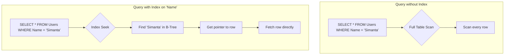

# 2.4 Indexes

A database index is a data structure that improves the speed of data retrieval operations on a database table. It works much like the index at the back of a book: instead of searching through the entire book for a topic, you look up the topic in the index, which tells you exactly which pages to go to.

## 1. Introduction

Without an index, a database must perform a **full table scan** every time you query for data based on a certain condition. This means it has to look at every single row in the table to find the ones that match. For large tables, this is extremely slow and inefficient. An index allows the database to find the required data quickly without scanning the entire table.

## 2. How Indexes Work

The most common type of index uses a data structure called a **B-Tree**. The index stores the values of the indexed column(s) in a sorted order, along with a pointer (or reference) to the corresponding row in the actual table.

Because the data in the B-Tree is sorted, the database can use efficient search algorithms (like a binary search) to find a specific value quickly. Once the value is found in the index, the database uses the pointer to locate the full row of data in the table.

## 3. Types of Indexes

*   **Single-Column Index:** The most common type, created on a single column.
*   **Composite (Multi-Column) Index:** An index created on multiple columns. The order of the columns in a composite index is very important. A composite index on `(last_name, first_name)` can be used efficiently for queries filtering on `last_name` or on both `last_name` and `first_name`, but it's less effective for queries filtering only on `first_name`.
*   **Unique Index:** Ensures that all values in the indexed column (or combination of columns) are unique. Primary keys are automatically unique indexes.

### Clustered vs. Non-Clustered Indexes

*   **Clustered Index:**
    *   Determines the **physical order** of data in a table. The data rows themselves are stored in the sorted order of the clustered index key.
    *   Because the data can only be physically sorted in one way, a table can only have **one** clustered index.
    *   In most database systems (like SQL Server and MySQL's InnoDB), the primary key is, by default, the clustered index.
*   **Non-Clustered Index:**
    *   Has a separate structure from the data rows.
    *   The index contains the indexed values and a pointer to the corresponding data row (which could be the clustered index key or a direct row identifier).
    *   A table can have multiple non-clustered indexes.

## 4. The Trade-offs of Using Indexes

Indexes are not a silver bullet. While they significantly improve read performance, they come with trade-offs.

*   **Read Performance (`SELECT`):**
    *   **Pro:** Drastically speeds up `SELECT` queries that have `WHERE` clauses on indexed columns. Also helps with `ORDER BY` operations.
*   **Write Performance (`INSERT`, `UPDATE`, `DELETE`):**
    *   **Con:** Slows down write operations. When you insert, update, or delete a row, the database must also update every index on that table to reflect the change. More indexes mean more work to do on each write.
*   **Storage Overhead:**
    *   **Con:** Indexes take up extra disk space. For large tables, indexes can be quite large themselves.

## 5. Best Practices for Indexing

*   **Index Selectively:** Don't index every column. Each index adds overhead.
*   **Index `WHERE` Clauses:** Index columns that are frequently used in `WHERE` clauses to filter data.
*   **Index Foreign Keys:** It's almost always a good idea to index foreign key columns, as they are frequently used in `JOIN` operations.
*   **Use Composite Indexes:** For queries that consistently filter on the same set of multiple columns, create a composite index. Order the columns in the index based on their selectivity (the most selective/unique column first).
*   **Analyze Query Plans:** Use database tools like `EXPLAIN` (in PostgreSQL and MySQL) or `Execution Plan` (in SQL Server) to analyze how the database is executing your queries. This is the definitive way to see if your indexes are being used effectively.
*   **Low Cardinality Columns:** Be cautious about indexing columns with low cardinality (i.e., very few unique values, like a "gender" column). An index on such a column is often not very helpful, as the database would still need to fetch a large percentage of the table's rows.
