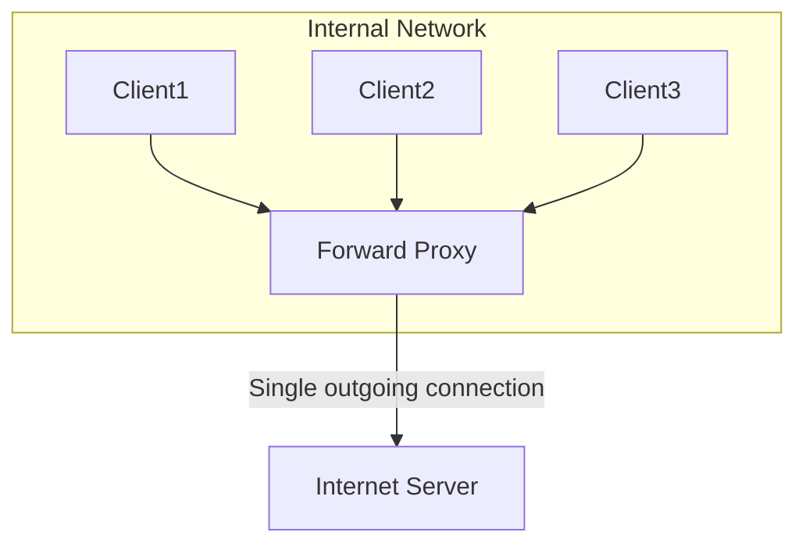
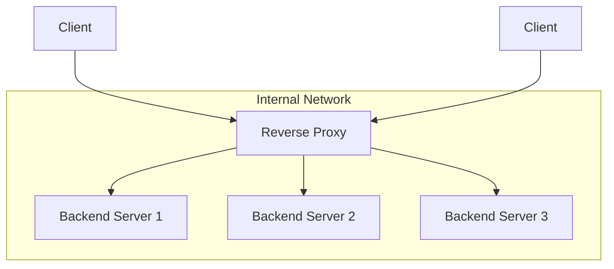

# 2.5 Proxies

A proxy server is an intermediary server that acts as a gateway between a client and a destination server. It forwards client requests to other servers and then returns the servers' responses to the client. There are two main types of proxies: forward proxies and reverse proxies.

## 1. Introduction

Depending on where it's placed and whose interests it serves, a proxy can perform a wide range of functions, including load balancing, security, caching, and anonymity.

## 2. Forward Proxy (or "Proxy")

A forward proxy is a proxy that sits in front of a group of client machines. When one of these clients makes a request to a server on the internet, the request is first sent to the forward proxy. The proxy then forwards the request to the destination server on behalf of the client.

**In short: A forward proxy acts on behalf of the client.**

*   **Use Cases:**
    *   **Bypassing Firewalls or Content Filters:** Commonly used in corporate or school networks to control and monitor internet access. Can also be used by clients to bypass regional content restrictions.
    *   **Anonymity:** Hides the client's IP address from the destination server, as the request appears to originate from the proxy server.
    *   **Caching:** Can cache responses from the internet to speed up access for all clients in the network and reduce bandwidth usage.

From the perspective of the destination server, it only sees a request coming from the forward proxy; it is unaware of the individual client behind it.

## 3. Reverse Proxy

A reverse proxy is a proxy that sits in front of a group of backend servers. When a client makes a request to a service, the request is first sent to the reverse proxy. The reverse proxy then decides which backend server should handle the request and forwards it accordingly.

**In short: A reverse proxy acts on behalf of the server.** This is the most common type of proxy used in system design.

*   **Use Cases (The Swiss Army Knife of System Design):**
    *   **Load Balancing:** This is a primary function. A reverse proxy can distribute incoming traffic across multiple backend servers, improving scalability and reliability.
    *   **SSL Termination:** The reverse proxy can handle incoming HTTPS connections, decrypting the requests and passing unencrypted requests to the internal backend servers. This offloads the computational work of SSL/TLS from the application servers.
    *   **Caching:** It can cache static content (like images or CSS) and even dynamic responses from backend servers, reducing the load on those servers.
    *   **Compression:** Can compress server responses before sending them to the client, reducing bandwidth and improving load times.
    *   **Security:** Hides the IP addresses and characteristics of the backend servers, providing a single, hardened point of entry to the internal network and protecting against attacks like DDoS.
    *   **API Gateway:** A reverse proxy often serves as an API gateway, handling tasks like authentication, authorization, rate limiting, and request routing in a microservices architecture.

From the perspective of the client, it only sees a connection to the reverse proxy; it is unaware of the backend servers that are actually processing its request.

## 4. Comparison: Forward Proxy vs. Reverse Proxy

| Feature           | Forward Proxy                                 | Reverse Proxy                                   |
| :---------------- | :-------------------------------------------- | :---------------------------------------------- |
| **Represents**    | The client                                    | The server                                      |
| **Location**      | In front of client machines (client's network)| In front of backend servers (server's network)  |
| **Primary Goal**  | Anonymity, filtering, bypassing restrictions  | Scalability, security, performance, reliability|
| **Visibility**    | Server doesn't know the actual client         | Client doesn't know the actual backend server   |
| **Common Examples**| Corporate/school web filters, personal VPNs | NGINX, HAProxy, API Gateways (e.g., Kong)       |

## 5. Popular Proxy Servers

*   **NGINX:** A high-performance web server that is also one of the most popular reverse proxies and load balancers.
*   **HAProxy:** A free, open-source proxy server that is highly regarded for its performance and reliability, especially for TCP and HTTP-based applications.
*   **Apache HTTP Server:** While primarily a web server, Apache can also be configured to act as a powerful reverse proxy.
