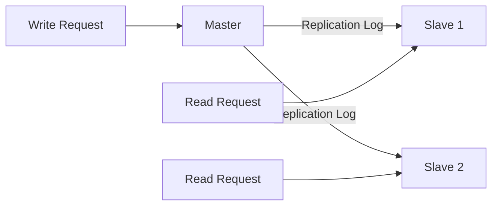

# 2.6 Redundancy and Replication

Redundancy and replication are foundational concepts for building reliable, fault-tolerant, and highly available systems. They are strategies used to eliminate single points of failure and ensure that a system can continue to operate even when components fail.

## 1. Introduction

*   **Redundancy:** The duplication of critical system components. This could mean having multiple web servers, multiple database servers, or even multiple power supplies. The goal of redundancy is to provide a backup that can take over if a primary component fails.
*   **Replication:** The process of copying and synchronizing data across redundant components. If you have redundant database servers, replication is the mechanism that ensures they all have the same data.

In short: **Redundancy provides the "what" (the backup components), and replication provides the "how" (the process of keeping them in sync).**

```mermaid
graph TD
    subgraph Non-Redundant System (Single Point of Failure)
        A[User] --> S1[Server];
        S1 --> DB1[Database];
    end

    subgraph Redundant System
        B[User] --> LB[Load Balancer];
        LB --> S2A[Server 1];
        LB --> S2B[Server 2];
        S2A --> DB_Master[Master DB];
        S2B --> DB_Master;
        DB_Master -- Replication --> DB_Slave[Slave DB];
    end
```

## 2. Redundancy in Practice

Redundancy can be applied at every layer of the system:
*   **Multiple Web/Application Servers:** Placing multiple identical servers behind a load balancer. If one server goes down, the load balancer redirects traffic to the healthy ones.
*   **Multiple Database Servers:** As seen in the diagram above, having backup database servers ready to take over.
*   **Hardware Redundancy:** Using servers with dual power supplies, multiple network cards, or RAID disk arrays to protect against hardware failure.
*   **Geographic Redundancy:** Running your application in multiple data centers or cloud availability zones to protect against large-scale outages (e.g., natural disasters, power grid failures).

## 3. Database Replication

Database replication is a common technique used to achieve both high availability and read scalability.

*   **High Availability:** If the primary database server fails, a replica (a copy) can be promoted to become the new primary, minimizing downtime. This process is called **failover**.
*   **Read Scalability:** For read-heavy applications, you can direct all write operations to a primary server and distribute read operations across multiple replica servers.

## 4. Database Replication Models

### 4.1 Master-Slave Replication

This is the most common replication model.

*   **How it works:** All write operations (`INSERT`, `UPDATE`, `DELETE`) are sent to a single **master** database. The master then replicates these changes to one or more **slave** databases. Read operations can be served by the slaves.
*   **Pros:**
    *   Relatively simple to set up and manage.
    *   Excellent for scaling read-heavy workloads.
*   **Cons:**
    *   The master is a single point of failure for write operations. If the master goes down, no new data can be written until a failover process is completed.
    *   **Replication Lag:** There can be a delay between a write occurring on the master and it being replicated to the slaves.



### 4.2 Master-Master Replication

In this model, two or more master nodes can accept write operations. Each master replicates its writes to all other masters.

*   **Pros:**
    *   Higher write availability. Writes can continue even if one master node fails.
    *   Can be useful for geographically distributed systems where you want to have a master in each region to reduce write latency.
*   **Cons:**
    *   Much more complex to manage, especially **write conflict resolution**. What happens if two clients try to update the same record on different masters at the same time? This requires a conflict resolution strategy, which can be difficult to implement correctly.

### 4.3 Leaderless Replication (e.g., in Cassandra, DynamoDB)

Used by many NoSQL databases. In this model, there is no single master. Any node in the cluster can accept writes.

*   **How it works:** When a client writes data to a node, that node replicates the data to a configurable number of other nodes (the replication factor). Reads and writes are considered successful if a certain number of nodes (a **quorum**) acknowledge the operation.
*   **Pros:** Very high write availability and excellent fault tolerance.
*   **Cons:** Consistency can be more complex to reason about (often tunable between strong and eventual consistency).

## 5. Replication Lag

Replication lag is the delay between a write being committed on the master and that write being visible on a slave. This is a critical consideration in master-slave architectures.

*   **Impact:** If an application writes data to the master and immediately tries to read it from a slave, it might get stale data because the write hasn't been replicated yet.
*   **Solutions:**
    *   For critical reads that must see the latest data, read directly from the master.
    *   Design the application to be tolerant of slightly stale data for non-critical reads.
