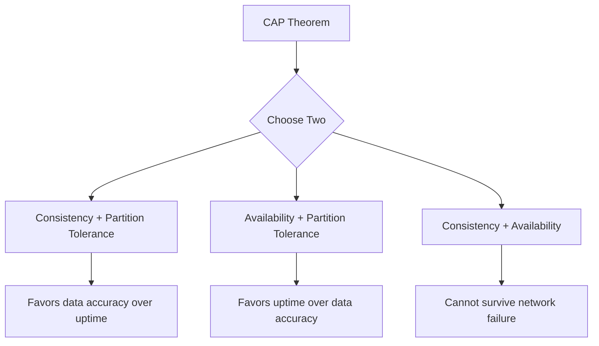

# 2.8 CAP Theorem

The CAP Theorem, also known as Brewer's Theorem, is a fundamental principle in distributed systems engineering. It states that it is impossible for a distributed data store to simultaneously provide more than two out of the following three guarantees: Consistency, Availability, and Partition Tolerance.

## 1. Introduction

When designing a distributed system (any system that involves multiple nodes communicating over a network), the CAP theorem highlights a critical trade-off that engineers must consider. Understanding this theorem helps in choosing the right database or technology for your specific needs.

## 2. The Three Properties

### 2.1 Consistency (C)

*   **Definition:** Every read request receives the most recent write or an error.
*   **In simpler terms:** All nodes in the cluster have the same view of the data at the same time. When data is written to one node, all subsequent reads from any other node in the system will see that new data. This is also known as strong consistency or linearizability.

### 2.2 Availability (A)

*   **Definition:** Every request receives a (non-error) response, without the guarantee that it contains the most recent write.
*   **In simpler terms:** The system is always operational and responsive. No request is ever dropped or returns an error due to the system being unavailable (though it might return stale data).

### 2.3 Partition Tolerance (P)

*   **Definition:** The system continues to operate despite an arbitrary number of messages being dropped (or delayed) by the network between nodes.
*   **In simpler terms:** A "network partition" is a communication break between two groups of nodes in the cluster. Partition tolerance means the system can handle such a break and continue to function.

## 3. The Trade-off

The CAP theorem states that a distributed system can only satisfy **at most two** of these three guarantees.

In any real-world distributed system, network failures (partitions) are a fact of life. A network can be unreliable; messages can be lost or delayed. Therefore, **Partition Tolerance (P) is a property that must be tolerated and designed for**.

This means the real trade-off in distributed system design is between **Consistency (C)** and **Availability (A)**. When a network partition occurs, you must choose one:

1.  **Cancel the operation** to guarantee consistency, thus sacrificing availability.
2.  **Proceed with the operation**, thus sacrificing consistency but ensuring availability.

## 4. The Two Choices

### 4.1 CP Systems (Consistency & Partition Tolerance)

When a network partition occurs, a CP system chooses to sacrifice availability to prevent data inconsistency. It does this by making the nodes on one side of the partition unavailable until the partition is resolved. This ensures that no client can read potentially stale data.

*   **Use Cases:** Systems where data consistency is paramount, such as banking systems, e-commerce transaction processing, or any application where atomic reads and writes are critical.
*   **Examples:** MongoDB (in its default configuration), many SQL databases configured for high consistency.

### 4.2 AP Systems (Availability & Partition Tolerance)

When a network partition occurs, an AP system chooses to sacrifice strong consistency to remain available. All nodes on both sides of the partition remain available to serve requests. However, since the nodes cannot communicate, they might return different (stale) versions of the data. These systems typically aim for **eventual consistency**, where the data will be synchronized once the partition resolves.

*   **Use Cases:** Systems where high availability is more important than strong consistency. For example, a social media site where it's acceptable for a user to see a slightly outdated "like" count, or a shopping cart system.
*   **Examples:** Cassandra, DynamoDB, CouchDB.

## 5. What about CA?

A CA system (Consistency and Availability) is one that provides both guarantees but cannot tolerate network partitions. This model is only applicable to systems that run on a single node (a non-distributed system), as there is no network between nodes that could fail. Traditional single-node relational databases (like a standalone PostgreSQL or MySQL server) are effectively CA systems.
