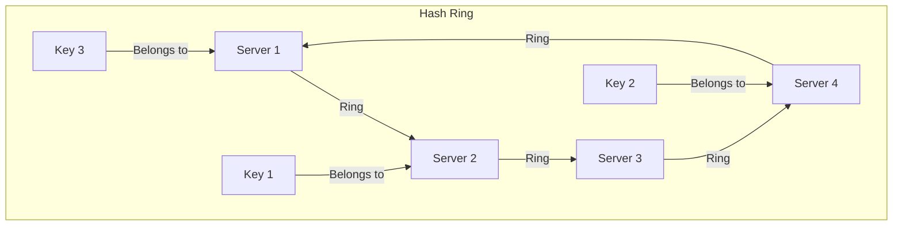

# 2.9 Consistent Hashing

Consistent hashing is a hashing technique used in distributed systems to solve the problem of re-hashing when servers are added or removed from a cluster. It's a crucial algorithm for distributed caching, databases, and load balancing.

## 1. Introduction

In a distributed system, it's common to distribute data or requests across a set of servers. A simple way to do this is to use a hash function, such as `hash(key) % N`, where `N` is the number of servers. However, this approach has a major flaw.

## 2. The Problem with Simple Modulo Hashing

Let's say you have a cluster of 4 cache servers (`N=4`). You use the formula `hash(key) % 4` to decide which server stores which key.

*   `hash(key1) % 4 = 1` -> Server 1
*   `hash(key2) % 4 = 3` -> Server 3
*   `hash(key3) % 4 = 1` -> Server 1

Now, what happens if Server 3 fails and is removed? Or what if you add a new server to handle more traffic?

The number of servers `N` changes. If you add a server, `N` becomes 5. Now, the formula is `hash(key) % 5`.

*   `hash(key1) % 5 = 4` -> Server 4 (previously Server 1)
*   `hash(key2) % 5 = 2` -> Server 2 (previously Server 3)
*   `hash(key3) % 5 = 4` -> Server 4 (previously Server 1)

Almost every key now maps to a different server. This means that when the number of servers changes, nearly all of your cached data becomes invalid simultaneously, causing a "cache stampede" or "thundering herd" where your backend database is suddenly flooded with requests. Consistent hashing solves this problem.

## 3. How Consistent Hashing Works

Consistent hashing maps servers and keys onto a circular hash space, often called a **hash ring**.

1.  **The Hash Ring:** Imagine a circle representing the output range of a hash function (e.g., 0 to 2^32 - 1).

2.  **Mapping Servers:** Each server is placed at one or more points on this ring. This is done by hashing the server's ID, IP address, or name to get its position on the circle.

3.  **Mapping Keys:** To determine which server a key belongs to, you hash the key to get its position on the ring. Then, you "walk" clockwise around the ring from the key's position until you find the first server. That server is the one responsible for that key.

### The Benefit: Adding or Removing Servers

The key advantage of consistent hashing is that when a server is added or removed, only a small fraction of the keys need to be remapped.

*   **Adding a Server:** When a new server (e.g., Server 5) is added to the ring, it is placed at a new position. It will now be responsible for all the keys that fall between its position and the position of the next server counter-clockwise. This means only the keys from its immediate clockwise neighbor need to be redistributed. The keys on all other servers remain unaffected.

*   **Removing a Server:** When a server fails or is removed, all the keys it was responsible for are simply re-assigned to the next server in the clockwise direction. The keys on all other servers remain unaffected.

This minimizes the amount of data that needs to be moved, avoiding the "cache stampede" problem of simple modulo hashing.

## 4. Virtual Nodes (Improving Distribution)

A potential issue with the basic consistent hashing algorithm is that servers might not be evenly distributed on the ring, leading to an uneven distribution of keys. One server might end up with a disproportionately large number of keys.

To solve this, a technique called **virtual nodes** is used. Instead of mapping each physical server to a single point on the ring, each server is mapped to multiple virtual nodes, each at a different position.

*   **Example:** Server A might be mapped to `Server_A_1`, `Server_A_2`, ... `Server_A_10`, each with a different hash.
*   **Benefit:** This spreads the load much more evenly across the ring and, by extension, across the physical servers. When a physical server is added or removed, the load is evenly distributed among the remaining servers.

## 5. Use Cases

Consistent hashing is a fundamental algorithm in many distributed systems:

*   **Distributed Caching:** (e.g., Memcached, Riak) to distribute cache data across a cluster of nodes.
*   **Distributed Databases:** (e.g., Cassandra, DynamoDB) to partition data across nodes.
*   **Load Balancing:** To distribute user requests across a set of servers in a way that minimizes disruption when servers are added or removed.
