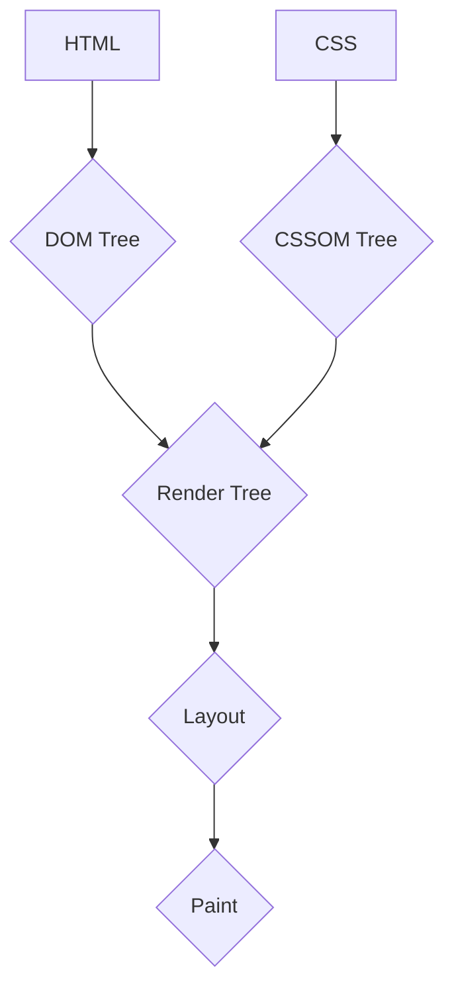

# 3.1 Client-Side Performance Optimization

Client-side performance is crucial for a good user experience. A slow-loading website can lead to high bounce rates and user frustration. This document outlines several key techniques for optimizing client-side performance.

## 1. Reducing HTTP Requests

Every HTTP request introduces latency. Reducing the number of requests is a fundamental optimization strategy.

*   **Bundling:** Combine multiple CSS or JavaScript files into a single file. Modern build tools like Webpack, Vite, and Parcel do this automatically.
*   **CSS Sprites:** Combine multiple small images into a single larger image (the "sprite sheet"). Use CSS `background-position` to display the desired part of the sprite. This reduces the number of image requests.
*   **Inlining:** For critical, small assets, you can inline them directly into the HTML document. For example, inlining critical CSS for above-the-fold content can significantly speed up the initial render.

## 2. Minimizing Payload Size

Reducing the size of your assets means they can be downloaded and parsed faster.

*   **Minification:** Remove unnecessary characters (whitespace, comments, etc.) from HTML, CSS, and JavaScript files.
*   **Image Optimization:**
    *   **Choose the right format:** Use JPEGs for photos, PNGs for images with transparency, and SVG for vector graphics. Consider modern formats like WebP for better compression.
    *   **Compression:** Compress images to reduce their file size without significant loss of quality.
    *   **Responsive Images:** Use the `<picture>` element or the `srcset` attribute to serve different image sizes based on the user's screen resolution and device.
*   **Tree Shaking:** In your JavaScript, tree shaking is the process of removing unused code from your final bundle. This is a feature of modern bundlers.

## 3. Optimizing the Critical Rendering Path

The Critical Rendering Path (CRP) is the sequence of steps the browser takes to convert HTML, CSS, and JavaScript into pixels on the screen. Optimizing this path is key to a fast initial render.

*   **Render-Blocking Resources:** By default, CSS is render-blocking, and JavaScript can be.
    *   Load CSS that is not critical for the initial render asynchronously.
    *   Use the `async` or `defer` attributes for `<script>` tags to avoid blocking the HTML parser. `defer` is often preferred as it guarantees the execution order of scripts.

## 4. Leveraging Browser Caching

Instruct the browser to cache assets so that on subsequent visits, it can load them from the local cache instead of making a network request.

*   **`Cache-Control` Header:** This HTTP header tells the browser how long it can cache a resource.
*   **`ETag` Header:** This header provides a validation token for a resource. When the resource expires, the browser can send the ETag to the server to check if the file has changed. If not, the server responds with a `304 Not Modified`, saving the download.

## 5. Lazy Loading

Lazy loading is the practice of deferring the loading of non-critical resources until they are needed.

*   **Images:** Use the `loading="lazy"` attribute on `` tags. This is now natively supported in most modern browsers.
*   **Components:** In single-page applications (SPAs), you can lazy-load components or routes, meaning the JavaScript for them is only downloaded when the user navigates to that route or needs that component.

## 6. Debouncing and Throttling

These techniques limit the rate at which a function can be executed, which is useful for event handlers like `scroll`, `resize`, or user input.

*   **Debouncing:** The function is only executed after a certain amount of time has passed without the event being triggered. Useful for search input suggestions.
*   **Throttling:** The function is executed at most once every specified interval. Useful for scroll animations.

## 7. Code Splitting

Code splitting is the process of breaking up your JavaScript bundle into smaller chunks that can be loaded on demand.

*   **Route-based splitting:** Load the code for a specific page only when the user visits that page.
*   **Component-based splitting:** Load the code for a component only when it's about to be rendered.

## 8. Using a Content Delivery Network (CDN)

A CDN is a network of servers distributed geographically. When you host your assets on a CDN, users will download them from a server that is physically closer to them, reducing network latency.
