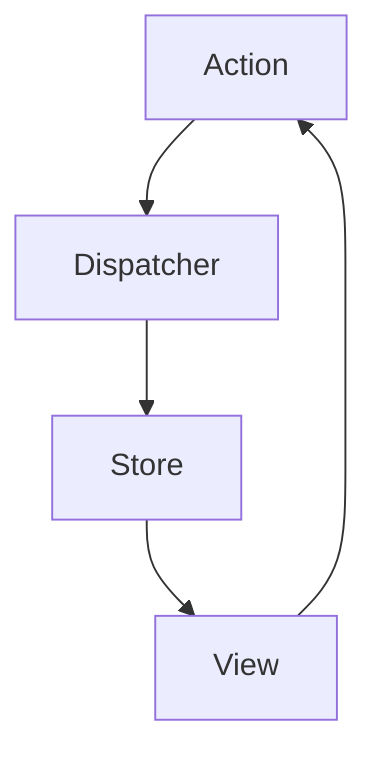

# 3.2 State Management Patterns

In frontend applications, "state" is any data that your application needs to remember and that can change over time. As applications grow in complexity, managing this state becomes a significant challenge. This document explores common patterns for state management.

## 1. What is State?

*   **Local State:** State that is managed within a single component. For example, the value of an input field in a form. In React, this is typically managed with the `useState` or `useReducer` hooks.
*   **Global State:** State that needs to be accessed by multiple components across the application. For example, the currently logged-in user's information or the theme (dark/light mode) of the application.

Managing global state is where things get tricky.

## 2. Patterns for State Management

### Prop Drilling

Prop drilling is the process of passing state down through multiple layers of nested components, even if some of the intermediate components don't need the state themselves.

```mermaid
graph TD
    A[Component A (has state)] --> B(Component B);
    B --> C(Component C (needs state));
```

While simple for small component trees, prop drilling becomes cumbersome and hard to maintain in large applications, as it creates tight coupling between components.

### Lifting State Up

This is a core concept in component-based frameworks like React. If multiple components need to share the same state, you "lift" the state up to their closest common ancestor. The ancestor then passes the state down to the components that need it via props. This is the standard solution for sharing state between a few components.

### Provider Pattern (Context API)

The Provider Pattern allows you to share state to a tree of components without explicitly passing props through every level. Frameworks like React have a built-in implementation of this pattern (the Context API).

*   You create a "Provider" that holds the state.
*   Any component within the subtree of that Provider can "consume" or access the state.

**Example in React:**

```javascript
// Create a context
const UserContext = React.createContext();

// App component with the Provider
function App() {
  const [user, setUser] = useState({ name: 'Simanta' });

  return (
    <UserContext.Provider value={user}>
      <UserProfile />
    </UserContext.Provider>
  );
}

// A deeply nested component that consumes the context
function UserProfile() {
  const user = useContext(UserContext);
  return <p>Welcome, {user.name}</p>;
}
```

The Context API is excellent for low-frequency updates of data that doesn't change often, like theme information or user authentication status.

### External State Management Libraries (Flux/Redux)

For complex applications with frequent state updates from many different sources, a more structured approach is often needed. This is where external libraries come in.

#### Flux Architecture

Flux is a design pattern (not a library) introduced by Facebook. It emphasizes a unidirectional data flow.



1.  **Action:** An object that describes a state change.
2.  **Dispatcher:** A central hub that receives actions and dispatches them to all registered stores.
3.  **Store:** Holds the application state and business logic. It updates itself in response to actions.
4.  **View:** Renders the state from the store and listens for updates. User interactions in the View can trigger new Actions.

#### Redux

Redux is a popular library inspired by Flux. It has a single, global store (a single source of truth) and enforces a strict unidirectional data flow.

*   **Single Source of Truth:** The entire state of your application is stored in a single object tree within a single store.
*   **State is Read-Only:** The only way to change the state is to dispatch an action.
*   **Changes are made with Pure Functions:** To specify how the state tree is transformed by actions, you write pure functions called "reducers".

Other popular libraries include **Zustand** (which offers a simpler, more hook-based approach) and **MobX** (which uses a more object-oriented, reactive approach).

## 3. Choosing a State Management Strategy

There is no one-size-fits-all solution.

*   **Start with local state:** Don't reach for a global state management solution prematurely.
*   **Use lifted state for small-scale sharing:** When a few components need to share state, find their common ancestor.
*   **Adopt Context API for low-frequency global state:** For theme, user info, etc.
*   **Consider an external library for complex, high-frequency updates:** When you have a large amount of application state that is updated by many parts of your application, a library like Redux or Zustand can provide structure and predictability.
