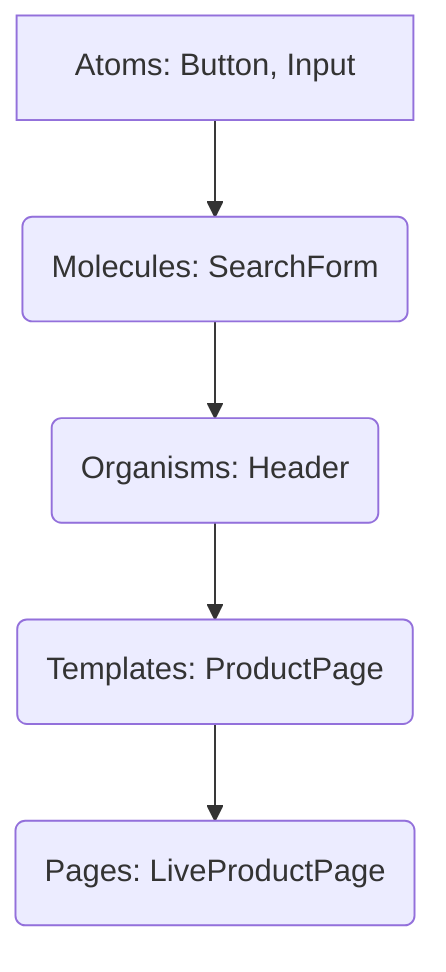

# 3.3 Component Library Design

A component library is a collection of reusable UI components (buttons, inputs, cards, etc.) that can be used across different applications or within a single large application. Designing a robust component library is essential for maintaining consistency, accelerating development, and improving maintainability in large frontend projects.

## 1. Introduction

**Why build a component library?**

*   **Consistency:** Ensures a unified look and feel across all applications that consume the library.
*   **Reusability:** Developers can quickly assemble UIs without rebuilding common elements from scratch.
*   **Faster Development:** Speeds up the development process by providing ready-to-use building blocks.
*   **Maintainability:** Centralized updates to components propagate to all consuming applications, simplifying maintenance.
*   **Scalability:** Facilitates scaling design systems and development across multiple teams.

## 2. Principles of Component Design

Adhering to these principles leads to more robust and manageable component libraries:

*   **Single Responsibility Principle (SRP):** Each component should have one primary reason to change. For instance, a `Button` component should handle button-specific logic and rendering, not form submission logic.
*   **Isolation:** Components should be self-contained and isolated from external styles or application-specific logic. They should be "dumb" or "presentational" as much as possible, focusing on rendering UI based on props.
*   **Composability:** Complex components should be built by combining simpler, atomic components. This adheres to the Atomic Design methodology.

*   **Configurability:** Components should be customizable through a well-defined set of props, allowing for flexibility without compromising consistency. Avoid over-configuration.

## 3. API Design (Props)

The props a component accepts define its public API. A good API is intuitive, predictable, and robust.

*   **Naming:** Use clear, descriptive, and consistent prop names (e.g., `isDisabled` instead of `disabled`).
*   **Data Types:** Define expected data types for props (using TypeScript or PropTypes) and provide sensible default values where appropriate.
*   **Booleans vs. Enums:**
    *   Use boolean flags for simple on/off states (e.g., `<Button primary />`).
    *   Use enums (string literals) for mutually exclusive options that represent different variations (e.g., `<Button variant="primary" />`, `<Button variant="secondary" />`, `<Button size="small" />`).
*   **Event Handlers:** Standardize event handler prop names (e.g., `onClick`, `onChange`, `onFocus`). Ensure they pass the native event object and/or relevant component-specific data.

## 4. Styling Strategy

How components are styled significantly impacts reusability and maintainability.

*   **CSS-in-JS (e.g., Styled Components, Emotion):**
    *   **Pros:** Scoped styles by default, dynamic styling based on props, component-colocated styles, easy theming.
    *   **Cons:** Runtime overhead, potential learning curve, can generate large CSS bundles if not optimized.
*   **CSS Modules:**
    *   **Pros:** Local scope for CSS classes by default, avoids naming collisions, standard CSS syntax.
    *   **Cons:** Requires a build step, slightly more verbose to use compared to CSS-in-JS for dynamic styles.
*   **Utility-First CSS (e.g., Tailwind CSS):**
    *   **Pros:** Rapid UI development, highly customizable, small final CSS bundle, no context switching between HTML and CSS files.
    *   **Cons:** Can lead to verbose HTML, initial learning curve, less suitable for truly unique designs without extensive configuration.

## 5. Accessibility (A11y)

Designing for accessibility ensures your components are usable by everyone, regardless of their abilities.

*   **Semantic HTML:** Use appropriate HTML elements (e.g., `<button>`, `<input>`, `<a>`) for their intended purpose.
*   **WAI-ARIA Roles and Attributes:** When native HTML elements aren't sufficient, use ARIA roles (e.g., `role="alert"`) and attributes (e.g., `aria-label`) to provide semantic meaning for assistive technologies.
*   **Keyboard Navigation:** Ensure all interactive components are navigable and operable using only the keyboard.
*   **Color Contrast:** Maintain sufficient color contrast between text and background to be legible for users with visual impairments.

## 6. Documentation

Comprehensive documentation is critical for the adoption and effective use of a component library.

*   **Why it's crucial:** Helps developers understand how to use components, their props, and best practices. Serves as a single source of truth for design and development.
*   **Tools like Storybook:** Storybook is an open-source tool for developing UI components in isolation. It provides an interactive playground, visual regression testing, and automatically generates documentation.
*   **Content:**
    *   Installation and usage instructions.
    *   Prop tables with descriptions, types, and default values.
    *   Usage examples, including different states and variations.
    *   Design guidelines and philosophy behind the components.
    *   Accessibility considerations.
