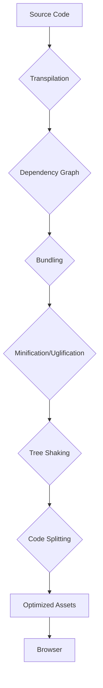

# 3.4 Build Systems and Bundlers

In modern frontend development, build systems and bundlers are indispensable tools. They transform raw source code (HTML, CSS, JavaScript, images, etc.) into optimized, production-ready assets that browsers can efficiently consume.

## 1. Introduction

**Why do we need them?**

*   **Modularity:** Allow developers to write code in small, manageable modules (e.g., ES Modules, CommonJS) and then combine them for browser execution.
*   **Optimization:** Reduce file sizes, improve load times, and enhance overall application performance.
*   **Development Experience:** Provide features like hot module replacement, live reloading, and error overlays that significantly improve developer productivity.
*   **Browser Compatibility:** Transpile modern JavaScript features to older versions, ensuring wider browser support.
*   **Asset Management:** Handle various file types (images, fonts, stylesheets) beyond just JavaScript.

## 2. Key Concepts

*   **Transpilation:** Converting source code written in one language (e.g., ES2020 JavaScript, TypeScript, JSX) into another version that browsers understand (e.g., ES5 JavaScript). **Babel** is a popular transpiler.
*   **Bundling:** Combining multiple JavaScript modules and their dependencies into a single or a few bundled files. This reduces the number of HTTP requests a browser needs to make.
*   **Minification & Uglification:** Removing unnecessary characters (whitespace, comments, newlines) and shortening variable/function names to reduce file size without changing functionality.
*   **Tree Shaking:** A form of dead code elimination where unused exports from modules are removed from the final bundle, further reducing its size.
*   **Code Splitting:** Dividing the application's bundle into smaller, more manageable chunks that can be loaded on demand (e.g., per route or per component). This improves initial load performance.
*   **Hot Module Replacement (HMR):** A development-time feature that allows modules to be updated in a running application without a full page refresh, preserving the application's state.
*   **Linting:** Analyzing code for potential errors, stylistic inconsistencies, and adherence to best practices (e.g., ESLint).
*   **Asset Management:** Processing and optimizing non-code assets like images (compression, optimization), stylesheets (Sass, Less, PostCSS), and fonts.

## 3. Popular Tools

### Webpack

*   **Description:** A highly configurable and powerful module bundler. It builds a dependency graph of your project and then bundles all modules into one or more bundles.
*   **Core Concepts:**
    *   **Entry:** Where Webpack starts building its internal dependency graph.
    *   **Output:** Where Webpack emits the bundles it creates.
    *   **Loaders:** Transform files from a different language (e.g., TypeScript, Sass) into JavaScript modules or inline assets.
    *   **Plugins:** Perform custom actions on compilation and bundle chunks (e.g., HTML generation, minification).
*   **Pros:** Extremely flexible, vast ecosystem, powerful optimizations.
*   **Cons:** Steep learning curve, complex configuration can be daunting for beginners.

### Rollup

*   **Description:** A module bundler for JavaScript that compiles small pieces of code into something larger and more complex, such as a library or application.
*   **Pros:** Excellent for building JavaScript libraries due to efficient tree-shaking and generation of smaller, cleaner bundles. Supports ES Modules natively.
*   **Cons:** Less flexible than Webpack for complex application bundling (e.g., HMR setup is more manual).

### Parcel

*   **Description:** A "zero configuration" web application bundler. It aims for speed and ease of use, automatically handling many common asset types and optimizations.
*   **Pros:** Very fast build times, minimal setup required, good for quick prototypes and smaller projects.
*   **Cons:** Less configurable than Webpack, which can be a limitation for highly custom build needs.

### Vite

*   **Description:** A next-generation frontend tooling that leverages native ES modules in the browser for incredibly fast development server startup times and hot module replacement. It uses Rollup for optimized production builds.
*   **Pros:** Extremely fast development server, excellent DX, modern approach to bundling.
*   **Cons:** Relatively newer, ecosystem is still growing compared to Webpack.

## 4. Comparison and Choosing a Tool

The choice of build tool depends on your project's needs:

| Feature           | Webpack                                       | Rollup                                | Parcel                                  | Vite                                              |
| :---------------- | :-------------------------------------------- | :------------------------------------ | :-------------------------------------- | :------------------------------------------------ |
| **Complexity**    | High (highly configurable)                    | Medium                                | Low (zero-config)                       | Low (smart defaults, Rollup for prod)             |
| **Best For**      | Complex SPAs, large applications              | Libraries, component packages         | Small to medium apps, quick prototypes  | Modern SPAs, projects favoring speed and DX       |
| **Dev Server**    | Good (HMR)                                    | Basic                                 | Fast (HMR)                              | Extremely fast (Native ESM, HMR)                  |
| **Plugins/Loaders** | Vast ecosystem                                | Good, but smaller than Webpack        | Auto-detects                             | Rollup plugins for production, Vite-specific for dev |
| **Tree Shaking**  | Good                                          | Excellent                             | Good                                    | Excellent                                         |

