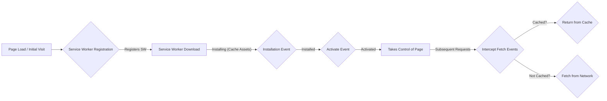

# 3.5 Progressive Web Apps (PWAs)

Progressive Web Apps (PWAs) are web applications that are progressively enhanced to provide a native app-like experience to users. They are designed to be **reliable**, **fast**, and **engaging**.

## 1. Introduction

PWAs combine the best of the web and the best of apps. They aim to deliver experiences that:
*   **Reliable:** Load instantly and never show the "downasaur", even in uncertain network conditions.
*   **Fast:** Respond quickly to user interactions with smooth animations.
*   **Engaging:** Feel like a natural app on the device, with immersive user experiences.

## 2. Core Components of a PWA

The magic behind PWAs primarily lies in two key technologies: Service Workers and the Web App Manifest, all served over HTTPS.

### 2.1 Service Workers

A Service Worker is a JavaScript file that your browser runs in the background, separate from the main web page. It acts as a programmable network proxy, intercepting network requests made by the main document.

*   **Capabilities:**
    *   **Offline Support:** Crucial for building reliable experiences. Service Workers can cache resources and serve them even when the network is unavailable.
    *   **Caching Strategies:** Implement sophisticated caching strategies (e.g., Cache-First, Network-First, Stale-While-Revalidate).
    *   **Push Notifications:** Re-engage users even when they are not actively using your application.
    *   **Background Sync:** Defer actions until the user has stable network connectivity (e.g., sending a message after going offline).
*   **Lifecycle:**
    1.  **Registration:** The browser downloads and registers the Service Worker file.
    2.  **Installation:** The browser attempts to install the Service Worker, which is an ideal time to cache static assets.
    3.  **Activation:** The Service Worker takes control of the page it was registered for.



### 2.2 Web App Manifest

The Web App Manifest is a simple JSON file that tells the browser about your web application and how it should behave when installed on the user's mobile device or desktop.

*   **Purpose:**
    *   **Home Screen Icon:** Specifies the icon that appears on the user's home screen.
    *   **Name:** Defines the name of the app displayed on the home screen and in app launchers.
    *   **Start URL:** Determines what page opens when the user launches the app.
    *   **Display Mode:** Controls whether the app opens in full-screen, standalone, minimal-ui, or browser mode.
    *   **Theme and Background Colors:** Provides default colors for the browser interface.

### 2.3 HTTPS

Service Workers can intercept network requests, which means they can potentially modify them. For security reasons, Service Workers can only be registered and used on pages served over HTTPS.

## 3. Key PWA Features and Benefits

*   **Offline Capability:** Users can continue browsing, or at least see cached content, even without an internet connection.
*   **Installability (Add to Home Screen):** Users can "install" the PWA directly from the browser to their device's home screen, making it accessible like a native app without an app store.
*   **Push Notifications:** Allows web applications to re-engage users by sending timely and relevant updates, even when the browser is closed.
*   **Background Sync:** Enables deferred actions. If a user tries to submit data while offline, the Service Worker can store the request and send it when connectivity is restored.
*   **Responsiveness:** PWAs are built with a responsive design, meaning they adapt to any screen size or device.
*   **App-like Interactions:** Smooth transitions, fluid scrolling, and gestures contribute to a native app-like feel.

## 4. Implementing a PWA (High-level Steps)

1.  **Serve over HTTPS:** Ensure your entire site is served securely.
2.  **Create a Web App Manifest:** Define your `manifest.json` and link it in your HTML.
3.  **Register a Service Worker:** Create your `service-worker.js` file and register it in your main JavaScript.
4.  **Implement Caching Strategies:** Use the Service Worker's `install` and `fetch` events to cache assets and respond to network requests.

## 5. Tools and Auditing

*   **Lighthouse:** A Google tool integrated into Chrome DevTools that audits web pages for performance, accessibility, best practices, SEO, and PWA criteria. It provides a score and actionable recommendations.

```mermaid
graph TD
    User[User Device] -- Request URL --> Browser[Browser];
    Browser -- Initial Request --> Network[Network (HTTPS)];
    Network -- HTML, CSS, JS --> Browser;
    Browser -- Registers --> SW[Service Worker];
    SW -- Caches Assets --> Cache[App Cache];
    User -- Disconnects from Internet --> Browser;
    Browser -- Subsequent Request --> SW;
    SW -- Offline? --> Cache;
    Cache -- Cached Response --> Browser;
    SW -- Online & Push Event --> Notification[Push Notification];
    SW -- Online & Background Sync --> BackgroundSync[Background Sync];
```