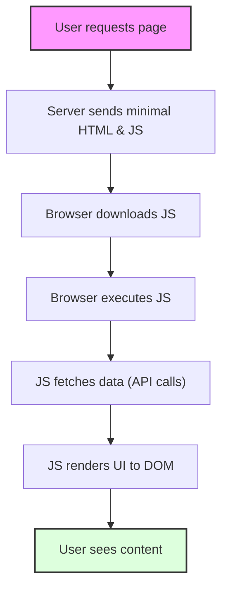
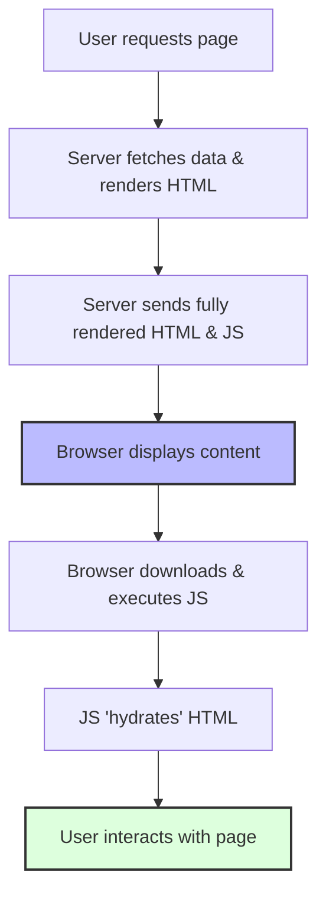
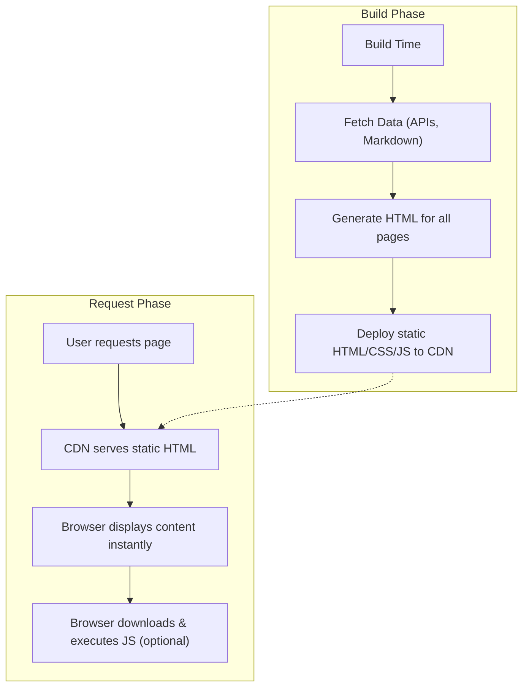

# 3.6 SSR and SSG Concepts

In modern web development, how your web application's content is rendered can significantly impact performance, SEO, and user experience. This document explores three primary rendering strategies: Client-Side Rendering (CSR), Server-Side Rendering (SSR), and Static Site Generation (SSG), along with a hybrid approach, Incremental Static Regeneration (ISR).

## 1. Introduction

Choosing the right rendering strategy depends on the nature of your application, the dynamism of its content, and your priorities regarding SEO and initial load performance.

## 2. Client-Side Rendering (CSR)

**Explanation:** In CSR, the browser receives a minimal HTML file (often just a `div` element and a script tag). The JavaScript framework (e.g., React, Angular, Vue) then fetches data and constructs the DOM directly in the browser.

*   **Pros:**
    *   Rich interactivity and dynamic content once loaded.
    *   Good for applications that are highly interactive and function like desktop apps (e.g., dashboards).
    *   Simplified server infrastructure (server only needs to serve static files).
*   **Cons:**
    *   **Poor Initial Load Performance:** Users see a blank page or loading spinner until JavaScript is downloaded, executed, and data is fetched.
    *   **SEO Challenges:** Search engine crawlers that don't execute JavaScript effectively may struggle to index content.
    *   Reliance on strong client-side hardware.

## 3. Server-Side Rendering (SSR)

**Explanation:** With SSR, the server renders the complete HTML for a page on each request, including the dynamic data. This fully formed HTML is then sent to the browser. The browser can display the content almost immediately. Once the JavaScript is downloaded and executed on the client-side, the application becomes interactive (a process called "hydration").

*   **Pros:**
    *   **Improved SEO:** Search engine crawlers see fully rendered content.
    *   **Faster First Contentful Paint (FCP):** Users see content much faster.
    *   Better perceived performance and user experience.
*   **Cons:**
    *   **Slower Time to First Byte (TTFB):** Server needs to perform rendering logic on each request, potentially delaying the initial response.
    *   Increased server load and infrastructure costs.
    *   Can be more complex to set up and manage.

## 4. Static Site Generation (SSG)

**Explanation:** SSG involves rendering pages to static HTML files at **build time**. These pre-rendered HTML files, along with their assets, can then be deployed to a CDN. Every user gets the exact same pre-built HTML page.

*   **Pros:**
    *   **Extremely Fast Loading:** Pages are static files, served directly by CDNs, resulting in near-instant load times.
    *   **Excellent SEO:** Content is fully available in the HTML for crawlers.
    *   **High Scalability and Security:** Static files are easy to cache and serve globally, with minimal attack surface.
    *   Lower hosting costs.
*   **Cons:**
    *   **Not suitable for highly dynamic content:** Requires a full rebuild and redeploy every time content changes.
    *   Cannot handle truly personalized content per user without client-side hydration.

## 5. Incremental Static Regeneration (ISR)

**Explanation:** ISR is a hybrid approach, popularized by Next.js, that allows you to update static content **after** your site has been built. Instead of rebuilding the entire site, individual static pages can be regenerated in the background at specified intervals or on demand.

*   A page is initially served as static HTML (from cache).
*   If a request comes in after a certain `revalidate` time, the cached page is served, but a regeneration process is initiated in the background.
*   Once regeneration is complete, the new version replaces the old one in the cache for subsequent requests.

*   **Pros:**
    *   Combines the speed and SEO benefits of SSG with the ability to show relatively fresh content.
    *   No need for full site rebuilds.
*   **Cons:**
    *   Can be more complex to implement and reason about cache invalidation.

## 6. Comparison and Choosing a Strategy

| Feature                  | CSR                               | SSR                                   | SSG                                     | ISR (Hybrid)                                |
| :----------------------- | :-------------------------------- | :------------------------------------ | :-------------------------------------- | :------------------------------------------ |
| **Initial Load**         | Slow (blank page)                 | Faster (content visible)              | Fastest (instant)                       | Fastest (instant, with freshness)           |
| **SEO**                  | Poor to Moderate                  | Excellent                             | Excellent                               | Excellent                                   |
| **Content Dynamism**     | Highly Dynamic                    | Dynamic per request                   | Static (requires rebuild for updates)   | Static with periodic background updates     |
| **Server Load**          | Low (static file serving)         | High (renders on each request)        | None (pre-built)                        | Low (re-renders only for revalidation)      |
| **Use Cases**            | Admin dashboards, highly interactive apps | E-commerce, blogs (dynamic parts)     | Marketing sites, documentation, blogs   | Blogs, e-commerce product pages             |
| **Framework Examples**   | React, Angular, Vue (default)     | Next.js, Nuxt.js, SvelteKit           | Next.js, Gatsby, Hugo, Jekyll           | Next.js                                     |
