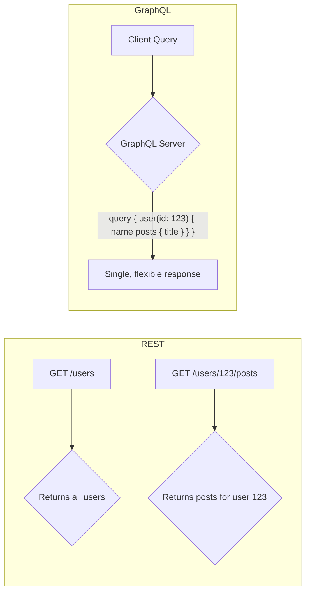

# 3.7 API Interaction Patterns (Frontend)

Efficient and robust API interactions are fundamental to the performance, user experience, and maintainability of any modern frontend application. This document explores common API architectures, data fetching strategies, and optimization techniques for frontend-backend communication.

## 1. Introduction

Frontend applications constantly need to communicate with backend services to fetch and manipulate data. The way this communication is structured directly impacts:
*   **User Experience (UX):** Responsiveness, perceived speed, and data consistency.
*   **Performance:** Network load, rendering times, and overall application speed.
*   **Data Integrity:** Ensuring data sent and received is correct and handled gracefully.

## 2. Common API Architectures

### 2.1 REST (Representational State Transfer)

REST is an architectural style for networked hypermedia applications. It's built on a few core principles:

*   **Stateless:** Each request from client to server must contain all the information needed to understand the request.
*   **Client-Server:** Separation of concerns between the client and the server.
*   **Cacheable:** Responses can be cached to improve performance.
*   **Uniform Interface:** Uses standard HTTP methods (GET, POST, PUT, DELETE) and resource-based URLs.

**Pros:**
*   **Simplicity:** Easy to understand and implement.
*   **Widely Adopted:** Large ecosystem of tools and libraries.
*   **Good Browser Support:** Works well with standard browser features (e.g., caching).

**Cons:**
*   **Over-fetching/Under-fetching:** Often, REST endpoints return more data than needed (over-fetching) or require multiple requests to get all necessary data (under-fetching).
*   **Multiple Requests for Complex Data:** Retrieving related resources (e.g., a user and their posts) often requires multiple API calls.

### 2.2 GraphQL

GraphQL is a query language for your API, and a server-side runtime for executing queries by using a type system you define for your data. It allows clients to specify exactly what data they need.

*   **Principles:**
    *   **Query Language:** Clients send queries describing their data requirements.
    *   **Single Endpoint:** Typically interacts with a single API endpoint.
    *   **Client Dictates Data:** The client requests only the data it needs, no more, no less.
    *   **Strong Typing:** Defined by a schema, ensuring data consistency.

**Pros:**
*   **Eliminates Over-fetching/Under-fetching:** Clients get exactly what they ask for.
*   **Single Request for Complex Data:** Reduces the number of round trips to the server.
*   **Strong Typing:** Provides better validation and autocompletion for development.
*   **Evolvable APIs:** Adding new fields to the schema doesn't break existing clients.

**Cons:**
*   **Learning Curve:** Requires understanding GraphQL query language and schema.
*   **Caching Complexity:** Client-side caching can be more involved compared to REST.
*   **N+1 Problem:** Can occur if resolvers are not optimized, leading to many database calls.

### 2.3 RPC (Remote Procedure Call)

RPC allows a client to execute a function or procedure in a remote address space (on a server) as if it were a local function call.

*   **Explanation:** The client sends a request that specifies a function name and its arguments. The server executes the function and sends back the result.
*   **Pros:**
    *   **Simplicity for specific operations:** Can be very straightforward for well-defined, imperative operations.
    *   Often **high performance** due to optimized serialization and transport.
*   **Cons:**
    *   **Tightly Coupled:** Client and server often need to agree on function signatures.
    *   **Less Standardized:** Can lead to custom implementations for each API.

## 3. Data Fetching Strategies

How and when you fetch data impacts the user experience.

*   **"Fetch on Render" (Basic `useEffect`):**
    *   The component renders, then `useEffect` or `componentDidMount` triggers data fetching.
    *   **Pros:** Simple for basic use cases.
    *   **Cons:** UI shows loading state, potential for waterfalls (data for child components starts fetching after parent data arrives).
*   **"Fetch then Render":**
    *   Data is fetched first, and only when it's fully available does the component render.
    *   **Pros:** Guarantees data is ready before UI is shown.
    *   **Cons:** Longer initial blank screen/loading state.
*   **"Render as You Fetch":**
    *   Fetching data and rendering components happen in parallel. This is typically achieved with tools like React Suspense, React Query, or SWR.
    *   **Pros:** Improves perceived performance by showing UI faster while data loads.
    *   **Cons:** Requires more advanced setup and error handling.

## 4. Optimizing API Interactions

*   **Client-Side Caching:**
    *   Using libraries like **React Query** or **SWR** to manage and cache fetched data, providing automatic re-fetching, deduplication, and optimistic updates.
    *   **HTTP Caching:** Leverage `Cache-Control` and `ETag` headers for browser-level caching of static API responses.
*   **Pagination:**
    *   **Offset-based:** (e.g., `?offset=0&limit=10`). Simple but can lead to skipped items if new items are added.
    *   **Cursor-based:** (e.g., `?after=cursor123&limit=10`). More robust for real-time data feeds, provides a stable pointer.
*   **Debouncing/Throttling:** Limit the frequency of API calls, especially for user input (search, resize).
*   **Batching/Bundling Requests:** Combine multiple smaller API calls into a single larger request, reducing network overhead.
*   **Request Cancellation (`AbortController`):** Cancel stale or irrelevant requests (e.g., when a user types quickly in a search bar, previous search requests can be aborted).
*   **Error Handling and Retries:** Implement robust error handling, including retries with exponential backoff for transient network issues.
*   **Optimistic UI Updates:** Update the UI immediately after a user action, assuming the API call will succeed, and revert if it fails. This significantly improves perceived performance.
*   **Request Prioritization:** For critical data, ensure its requests are prioritized over less critical ones.
