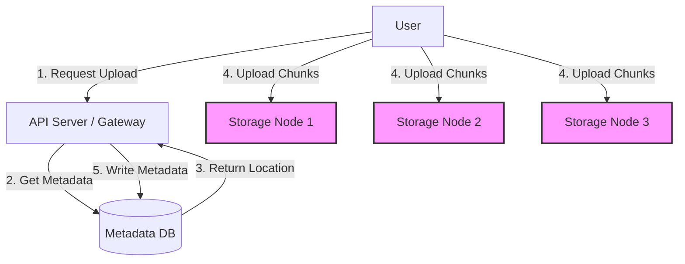

# 4.2 Blob Storage

Blob (Binary Large Object) storage, also known as object storage, is a type of data storage designed to hold massive amounts of unstructured data. Unstructured data is any data that doesn't conform to a traditional, structured data model, such as images, videos, audio files, log files, backups, and virtual machine images.

## 1. Introduction

Unlike a traditional file system that uses a hierarchical directory structure, blob storage systems manage data as distinct units called **objects**. These systems are a fundamental component of most modern cloud platforms and large-scale applications.

## 2. Key Characteristics

*   **Object-based:** Each object is a self-contained unit consisting of:
    *   **Data:** The actual content of the file (e.g., the pixels of an image).
    *   **Metadata:** A set of key-value pairs describing the object (e.g., content type, creation date, author).
    *   **Unique ID:** A globally unique identifier used to retrieve the object.
*   **Flat Namespace:** Objects are typically stored in a flat address space within a "bucket" or "container". You cannot have a bucket inside another bucket. While you can simulate folders using prefixes in object names (e.g., `photos/2023/my-vacation.jpg`), there is no true directory hierarchy.
*   **HTTP/S API:** Objects are accessed via a simple, web-based API using standard HTTP verbs like `PUT` (to upload), `GET` (to retrieve), and `DELETE`.
*   **High Durability and Availability:** Blob storage systems are designed for extreme durability (e.g., Amazon S3's 99.999999999% durability). This is achieved by automatically replicating data across multiple servers and often across multiple physical data centers or availability zones.
*   **Massive Scalability:** Designed to scale to store trillions of objects and exabytes of data.

## 3. Use Cases

*   **User-Generated Content:** The primary storage for photos and videos on platforms like Instagram, Facebook, and YouTube.
*   **Backup, Recovery, and Archiving:** A cost-effective solution for database backups, application logs, and long-term data archival.
*   **Big Data & Data Lakes:** Storing vast amounts of raw data that can be used for big data analytics, machine learning, and AI.
*   **Static Asset Hosting:** Hosting static website content (images, CSS, JS files) that can be served directly to users or via a CDN.
*   **Cloud-Native Applications:** Storing application data, build artifacts, and container images.

## 4. High-Level Design of a Blob Storage System

Here's a simplified look at the architecture of a blob storage system like Amazon S3.

*   **Write Path:**
    1.  The client requests to upload a file.
    2.  The API Server (or a dedicated metadata service) determines where the data chunks should be stored.
    3.  The client uploads the object's data directly to the storage nodes. For large files, the file is split into smaller chunks, which can be uploaded in parallel.
    4.  The data is replicated across multiple storage nodes to ensure durability.
    5.  Once the data is successfully stored, the metadata (object ID, chunk locations, size, etc.) is committed to a highly available metadata database. This database is the "index" of the system.
*   **Read Path:**
    1.  The client requests an object by its unique ID.
    2.  The API Server looks up the object's metadata to find the locations of its data chunks.
    3.  The server retrieves the data from the storage nodes and streams it back to the client.
    4.  For frequently accessed objects, a CDN is placed in front of the blob store to cache the data and serve it to users with lower latency.

## 5. Key Considerations

*   **Data Deduplication:** To save space, some systems calculate a hash of each data chunk. If a chunk with the same hash already exists, they simply store a pointer to the existing chunk instead of storing the same data twice.
*   **Erasure Coding:** A more space-efficient alternative to simple replication for durability. It involves breaking data into fragments and encoding them with redundant data pieces. The system can then recreate the original data even if some of the fragments are lost.
*   **Small vs. Large Files:** The system needs to be optimized for both. Small files can create metadata overhead, while large files need to be chunked and streamed efficiently.

## 6. Popular Examples

*   **Amazon S3 (Simple Storage Service)**
*   **Google Cloud Storage**
*   **Azure Blob Storage**
