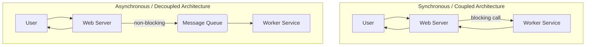

# 4.3 Distributed Messaging Queues

A distributed messaging queue is an intermediary service that enables asynchronous communication between different parts of a software system. It allows services (producers) to send messages without having to communicate directly with the services that will receive them (consumers).

## 1. Introduction

In a complex, distributed architecture, direct communication between services can lead to tight coupling and reduced fault tolerance. If Service A makes a synchronous call to Service B, Service A is blocked until it gets a response, and if Service B is down, Service A will fail. Message queues solve this by providing a buffer that decouples the services.

## 2. Why Use a Message Queue?

*   **Decoupling:** The producer and consumer services are completely independent. The producer's only responsibility is to send a message to the queue, and the consumer's only responsibility is to process a message from the queue. They don't need to know each other's location, implementation, or availability.
*   **Asynchronous Processing:** This is a primary use case. It allows a user-facing service to offload long-running tasks to be executed in the background. For example, when a user requests a report, the web server can add a "generate report" message to a queue and immediately respond to the user. A separate worker service can then process the job from the queue.
*   **Load Leveling / Buffering:** Message queues are excellent for smoothing out bursts of traffic. If a service suddenly receives a high volume of requests, it can add them all to a queue. The consumer services can then process these messages at a steady rate, preventing the system from being overloaded.
*   **Improved Reliability:** If a consumer service fails while processing a message, the message can be returned to the queue to be processed by another consumer or re-processed later. This prevents data from being lost.

## 3. Core Concepts

*   **Producer (or Publisher):** The application that creates and sends messages to the queue.
*   **Consumer (or Subscriber):** The application that connects to the queue and processes the messages it receives.
*   **Queue / Topic (or Broker):** The intermediary data structure that stores the messages.
*   **Message:** The data itself that is sent from the producer to the consumer. A message typically consists of a header (metadata) and a body (the payload).

## 4. Common Messaging Models

*   **Point-to-Point (Queue Model):**
    *   A message is sent to a specific queue.
    *   It is delivered to **exactly one** consumer that is listening to that queue.
    *   Use Case: Task processing, where you want each task to be performed by only one worker.
*   **Publish/Subscribe (Pub/Sub Model):**
    *   A message is published to a **topic**.
    *   It is delivered to **all** consumers that are subscribed to that topic.
    *   Use Case: Fan-out notifications, where multiple services need to react to the same event. For example, a "new user signed up" event might be sent to an email service, a data warehousing service, and a welcome-coupon service.

## 5. Key Considerations

*   **Message Persistence:** Should messages be stored on disk (persisted) by the broker? Persisting messages ensures that they will survive a broker restart, but it can come with a performance cost.
*   **Delivery Guarantees:**
    *   **At Most Once:** A message will be delivered once or not at all. There is a risk of message loss but no risk of duplicates.
    *   **At Least Once:** A message will be delivered at least one time, but it might be delivered multiple times if an acknowledgment is lost. This requires consumers to be **idempotent** (i.e., processing the same message multiple times has the same effect as processing it once). This is a common guarantee.
    *   **Exactly Once:** A message will be delivered exactly one time. This is the strongest guarantee but is the most difficult and costly to achieve.
*   **Message Ordering:** Does the order in which messages are produced need to be the same order in which they are consumed? Guaranteeing strict ordering can limit the throughput of a system.

## 6. Popular Message Queue Systems

*   **RabbitMQ:** A mature, traditional message broker that is widely used and supports multiple messaging protocols (like AMQP). It's very flexible and supports complex routing scenarios.
*   **Apache Kafka:** A distributed streaming platform. It's designed for extremely high throughput and durability, making it ideal for log aggregation, real-time analytics, and event sourcing. It persists messages for a configurable period, allowing them to be re-read.
*   **Amazon SQS (Simple Queue Service):** A fully managed, highly scalable message queuing service offered by AWS. It's simple to use and provides "at least once" delivery.
*   **Redis:** While primarily known as a cache, Redis's Pub/Sub and List commands allow it to be used as a simple, high-performance message broker for certain use cases.
