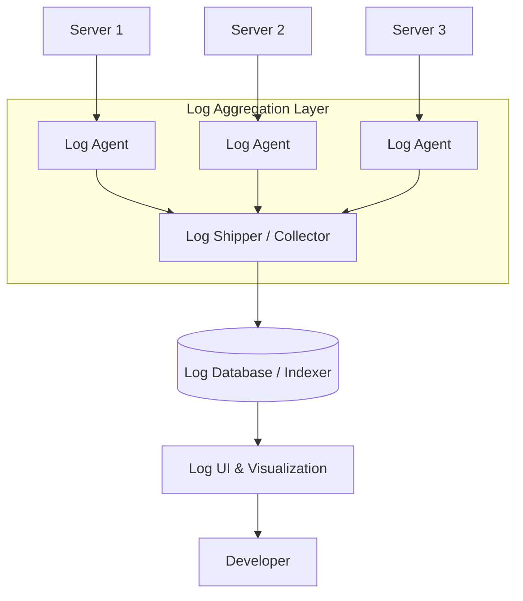
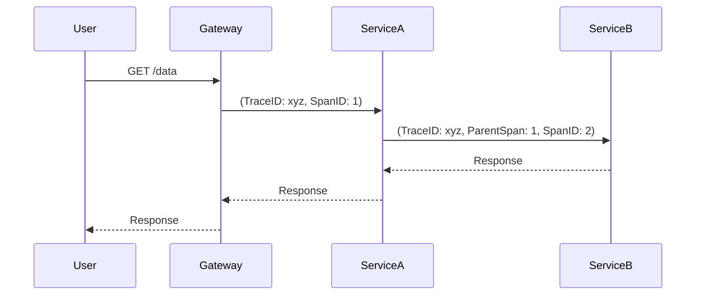

# 4.4 Distributed Logging, Metrics, and Tracing

In a distributed system, where an application is composed of many services running on many servers, understanding the system's behavior and diagnosing problems can be incredibly difficult. **Observability**, which is typically broken down into three pillars—logging, metrics, and tracing—is the key to managing this complexity.

## 1. Introduction

*   **Logging:** Tells you *what* happened. Logs are detailed, timestamped records of discrete events.
*   **Metrics:** Tell you *how* your system is performing. Metrics are aggregated, numerical measurements of the system's health over time.
*   **Tracing:** Tells you *where* a problem occurred. Tracing follows a single request as it moves through all the different services in your system.

## 2. Distributed Logging

In a distributed system, application logs are scattered across dozens or hundreds of servers. Searching for a specific error by SSH-ing into each machine is not feasible. This requires a **centralized logging** solution.

### Centralized Logging Architecture

1.  **Log Collection/Shipping:** A lightweight agent (e.g., **Fluentd**, **Logstash**, **Filebeat**) runs on each application server. Its job is to collect log files, format them, and ship them to a central location. It's important to enrich logs with metadata at this stage (e.g., the host, the service name).
2.  **Log Storage & Indexing:** The logs are sent to a centralized database that is optimized for storing and searching large volumes of text data. **Elasticsearch** is a very popular choice for this.
3.  **Log Visualization & Analysis:** A user interface is needed to allow developers to search, filter, and visualize the logs. **Kibana** (for Elasticsearch) and **Grafana** are common tools for this.

A popular open-source combination for this is the **ELK Stack** (Elasticsearch, Logstash, Kibana) or the **EFK Stack** (Elasticsearch, Fluentd, Kibana).

## 3. Metrics (Monitoring)

Metrics are numerical measurements of your system's health, typically stored as time-series data.

*   **Types of Metrics:**
    *   **System Metrics:** CPU utilization, memory usage, disk space, network I/O.
    *   **Application Metrics:** Request latency (e.g., 95th percentile), error rates (e.g., number of 5xx errors), throughput (QPS).
    *   **Business Metrics:** Number of user sign-ups, items added to cart, revenue per minute.

*   **Metrics Architecture:**
    *   **Push vs. Pull Model:**
        *   **Push (e.g., StatsD):** Services actively push their metrics to a monitoring system.
        *   **Pull (e.g., Prometheus):** The monitoring system periodically "scrapes" a `/metrics` endpoint exposed by the services. The pull model is often preferred as it's easier to manage and less likely to overwhelm the monitoring system.
    *   **Components:**
        *   **Time-Series Database (TSDB):** A database optimized for storing and querying time-series data (e.g., **Prometheus**, **InfluxDB**).
        *   **Visualization & Dashboarding:** A tool to create graphs and dashboards from the metrics data (e.g., **Grafana**).

*   **Alerting:** A critical part of monitoring is setting up alerts. When a key metric (like error rate or latency) crosses a predefined threshold, an alert is automatically sent to the engineering team via tools like PagerDuty, Slack, or email.

## 4. Distributed Tracing

While logs can tell you an error occurred and metrics can tell you latency is high, distributed tracing tells you *why*. It tracks a single request from the moment it enters the system through every microservice it touches.

### How it Works

1.  When a request first enters the system (e.g., at the API Gateway), it is assigned a unique **Trace ID**.
2.  This Trace ID is passed along in the request headers to every subsequent downstream service call.
3.  Each service adds its own "span" to the trace, recording how long it took to process its part of the request.
4.  This data is sent to a tracing backend (e.g., **Jaeger**, **Zipkin**), which stitches the spans together into a complete trace.

**Benefits:**
*   **Pinpoint Latency Bottlenecks:** You can visualize the entire request lifecycle and see exactly which service call is taking the most time.
*   **Understand Service Dependencies:** Helps in understanding the complex interactions between microservices.
*   **Root Cause Analysis:** Quickly identify which service is responsible for an error in a long chain of calls.

**OpenTelemetry** is an emerging open-source standard for instrumenting applications to generate telemetry data (logs, metrics, and traces) in a vendor-neutral way.
