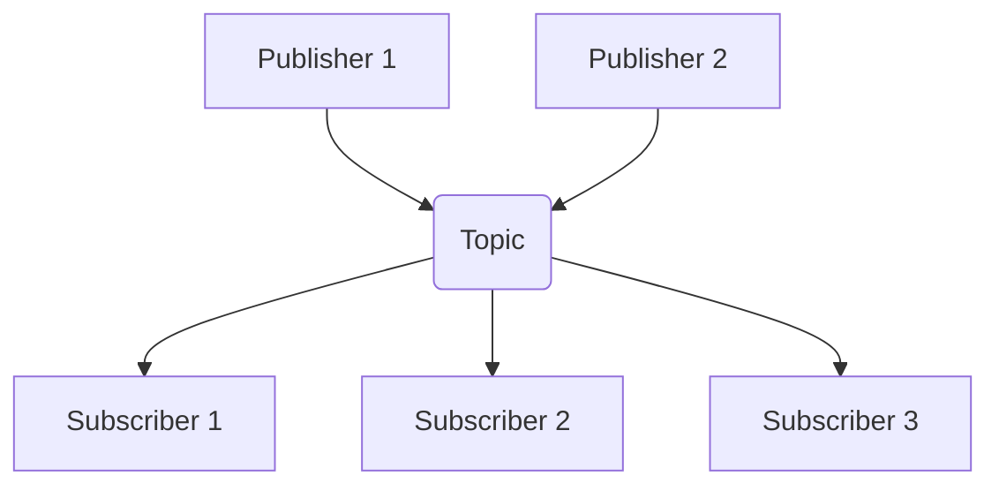

# 4.5 Pub-Sub Pattern

The Publish-Subscribe (Pub/Sub) pattern is a messaging pattern where message senders (publishers) do not send messages directly to specific receivers (subscribers). Instead, publishers send messages to "topics" or "channels," and subscribers register their interest in one or more of these topics. The underlying infrastructure (the message broker) is then responsible for delivering the messages to all interested subscribers.

## 1. Introduction

The Pub/Sub pattern is a powerful tool for building scalable, decoupled, and event-driven systems. It enables asynchronous, many-to-many communication between different parts of an application.

## 2. Core Components

*   **Publisher:** The component that creates and sends messages. It doesn't know anything about the subscribers. It simply categorizes each message into a specific topic and sends it to the message broker.
*   **Subscriber:** The component that receives messages. It expresses interest in one or more topics and will only receive messages that are published to those topics.
*   **Topic/Channel:** An intermediary channel managed by the message broker. Publishers send messages to topics, and subscribers receive messages from topics they are subscribed to.
*   **Message Broker:** The infrastructure that manages the topics and the process of fanning out messages from publishers to the correct subscribers.

## 3. Key Characteristics

*   **Loose Coupling:** The Pub/Sub pattern provides an extreme level of decoupling. Publishers and subscribers are completely unaware of each other's existence. They only need to know the name of the topic and how to communicate with the message broker. This allows you to add or remove publishers and subscribers without affecting other parts of the system.
*   **Asynchronous Communication:** Publishers can send messages and move on, without waiting for subscribers to receive or process them. This improves the responsiveness and efficiency of the overall system.
*   **Scalability:** The pattern allows for easy and independent scaling. You can add more publishers to increase the volume of incoming messages or add more subscribers to increase the processing capacity, all without any configuration changes to the other components.

## 4. Pub/Sub vs. Message Queue (Point-to-Point)

While both are messaging patterns, they serve different purposes.

| Feature         | Message Queue (Point-to-Point)               | Publish-Subscribe (Pub/Sub)                          |
| :-------------- | :------------------------------------------- | :--------------------------------------------------- |
| **Delivery**    | A message is delivered to **one** consumer.  | A message is delivered to **all** subscribers.       |
| **Coupling**    | Loosely coupled.                             | **Very** loosely coupled.                            |
| **Primary Use** | Task distribution, command processing.       | Event notification, data broadcasting (fan-out).     |
| **Analogy**     | A to-do list for a team of workers.          | A newspaper subscription.                            |
| **Diagram**     | `Producer -> Queue -> Consumer`              | `Publisher -> Topic -> Multiple Subscribers`         |

## 5. Use Cases

The Pub/Sub pattern is ideal for any scenario where an event needs to be broadcast to multiple interested parties.

*   **Fan-out Notifications:** This is the classic use case. For example, when a user uploads a new photo, a "photo-uploaded" event can be published. Subscribers could include:
    *   A service to generate thumbnails.
    *   A service to scan the photo for inappropriate content.
    *   A service to notify the user's followers.
*   **Real-time Data Streaming:** Broadcasting real-time data like stock prices, sports scores, or IoT sensor data to a large number of clients.
*   **Distributed Cache Invalidation:** In a distributed system, when data is updated in the database, a "data-changed" message can be published to a topic. All application servers can subscribe to this topic and, upon receiving the message, invalidate their local caches for that data.
*   **Event-Driven Architectures:** Pub/Sub is a core tenet of event-driven systems, where services communicate and react to asynchronous events rather than direct, synchronous requests.

## 6. Popular Pub/Sub Systems

*   **Apache Kafka:** A high-throughput, durable, distributed streaming platform that is often used for Pub/Sub at massive scale.
*   **RabbitMQ:** A traditional message broker that can implement Pub/Sub using a "fanout exchange".
*   **Redis:** Provides simple, high-performance Pub/Sub commands, but with weaker delivery guarantees (it's "fire and forget").
*   **Google Cloud Pub/Sub:** A fully managed, highly scalable Pub/Sub service from Google Cloud.
*   **Amazon SNS (Simple Notification Service):** A managed Pub/Sub service from AWS, often used for sending notifications to a large number of subscribers.
