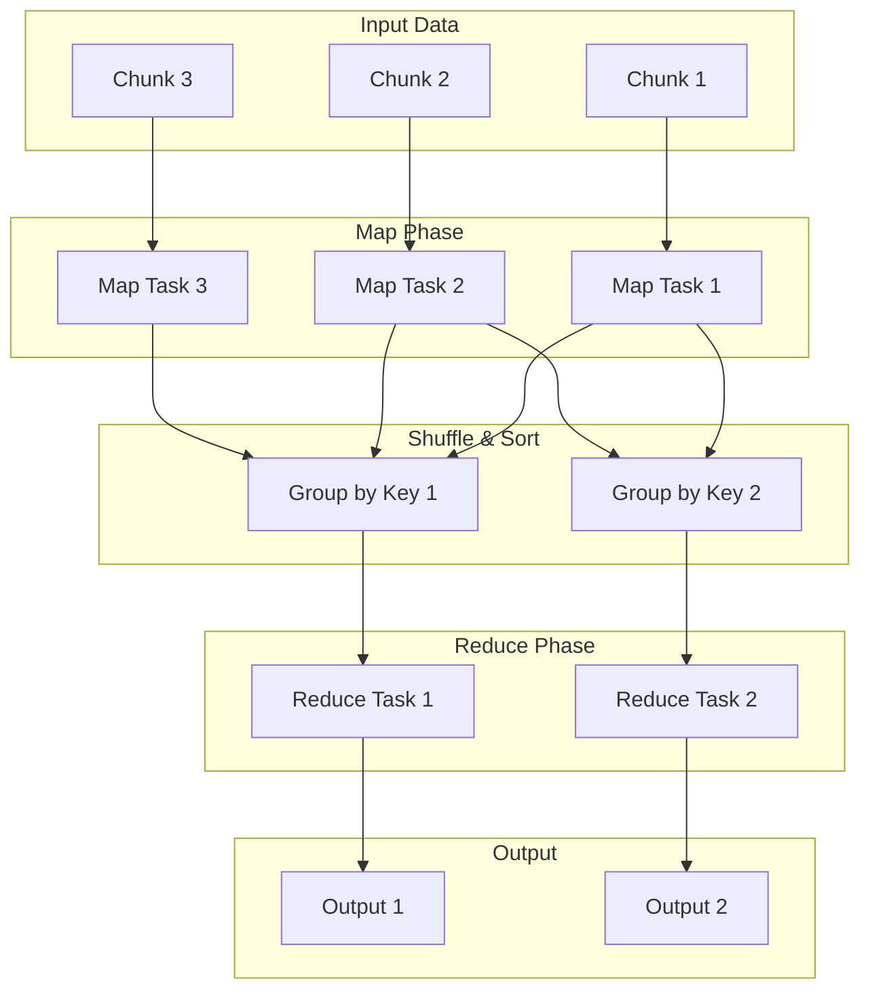

# 4.7 MapReduce

MapReduce is a programming model and an associated implementation for processing and generating massive data sets with a parallel, distributed algorithm on a cluster. It was originally developed by Google and was a foundational technology for big data processing.

## 1. Introduction

The core idea of MapReduce is to break down a large, complex processing job into many smaller, independent tasks that can be executed in parallel across a cluster of commodity machines. This allows for horizontal scaling and provides a high degree of fault tolerance.

The model is inspired by the `map` and `reduce` functions used in functional programming.

## 2. The MapReduce Workflow

The process consists of three main phases: Map, Shuffle & Sort, and Reduce.

### 2.1 Map Phase

1.  The input data (e.g., a multi-terabyte log file) is split into smaller, independent chunks.
2.  These chunks are distributed to multiple worker nodes in the cluster.
3.  Each worker node applies a user-defined `map` function to its chunk of data.
4.  The purpose of the `map` function is to take a set of data and convert it into a set of intermediate key-value pairs.
5.  The output of all the map tasks is stored on the local disks of the worker nodes.

### 2.2 Shuffle & Sort Phase

1.  This phase is handled automatically by the MapReduce framework.
2.  The framework collects all the intermediate key-value pairs from the map tasks.
3.  It then sorts and groups these pairs by their key, so that all values with the same key are brought together.

### 2.3 Reduce Phase

1.  The grouped data is now distributed to the reduce tasks. Each reducer works on one or more keys.
2.  A user-defined `reduce` function is applied to the list of values for each key.
3.  The purpose of the `reduce` function is to aggregate, summarize, or combine the values for a given key to produce a final output.

## 3. A Simple Example: Word Count

Word Count is the "Hello, World!" of MapReduce. The goal is to count the occurrences of each word in a large collection of documents.

*   **Input:** "Hello world", "Hello Spark", "Goodbye world"

*   **Map Phase:** The `map` function takes a line of text, splits it into words, and for each word, emits a `(word, 1)` key-value pair.
    *   `Map("Hello world")` -> `(Hello, 1)`, `(world, 1)`
    *   `Map("Hello Spark")` -> `(Hello, 1)`, `(Spark, 1)`
    *   `Map("Goodbye world")` -> `(Goodbye, 1)`, `(world, 1)`

*   **Shuffle & Sort Phase:** The framework groups the intermediate pairs by key.
    *   `(Hello, [1, 1])`
    *   `(world, [1, 1])`
    *   `(Spark, [1])`
    *   `(Goodbye, [1])`

*   **Reduce Phase:** The `reduce` function takes a key and its list of values and sums them up.
    *   `Reduce(Hello, [1, 1])` -> `(Hello, 2)`
    *   `Reduce(world, [1, 1])` -> `(world, 2)`
    *   `Reduce(Spark, [1])` -> `(Spark, 1)`
    *   `Reduce(Goodbye, [1])` -> `(Goodbye, 1)`

*   **Final Output:** A list of words and their total counts.

## 4. Key Characteristics

*   **Parallelism:** The map and reduce tasks areembarrassingly parallel, allowing them to run across hundreds or thousands of machines simultaneously.
*   **Fault Tolerance:** The MapReduce framework (like Apache Hadoop) automatically handles failures. If a node running a map or reduce task fails, the master node simply reschedules the task on another healthy node.
*   **Scalability:** MapReduce scales linearly. By adding more machines to the cluster, you can process larger datasets in roughly the same amount of time.

## 5. Use Cases

*   **Large-scale data processing and analysis:** Analyzing log files, clickstream data, scientific data.
*   **Building search engine indexes:** Processing web pages to build inverted indexes.
*   **Machine learning:** Used for large-scale training of certain types of ML models.
*   **Graph analysis:** Analyzing large graphs like social networks.

## 6. Modern Alternatives

While MapReduce was foundational for the big data ecosystem, it has some limitations (e.g., high latency, reliance on disk I/O). Modern data processing frameworks have built upon its ideas:

*   **Apache Spark:** A more general-purpose and often faster data processing engine. It can perform MapReduce-style operations but also supports more complex workflows and leverages in-memory processing to achieve higher performance.
*   **Apache Flink:** A streaming data processing engine that also provides a batch processing API. It's known for its low latency and high throughput.
