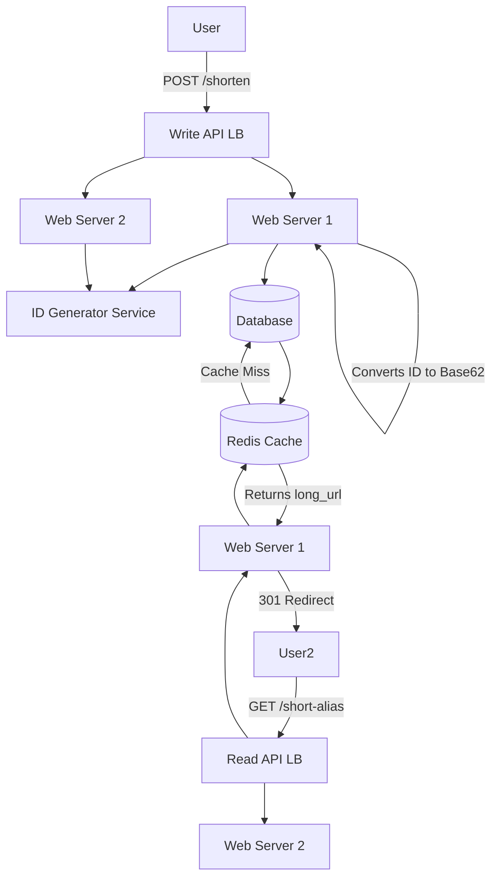

# 5.1.1 Designing a URL Shortening Service

A URL shortening service, like bit.ly or tinyurl.com, takes a long URL and generates a much shorter, unique alias. When a user accesses the short alias, they are redirected to the original long URL. This is a classic system design interview question.

## 1. Requirements

### Functional Requirements:
1.  Given a long URL, generate a shorter, unique alias (the "short link").
2.  When the short link is accessed, the user should be redirected to the original long URL.
3.  Users should optionally be able to specify a custom alias.

### Non-Functional Requirements:
*   **High Availability:** The service, especially the redirection, must be highly available.
*   **Low Latency:** The redirection must be very fast.
*   **Scalability:** The system must handle a high volume of new URL creations and an even higher volume of redirections.
*   **Unpredictable Aliases:** The auto-generated short links should not be easily guessable.

### Scale Estimations:
*   Assume 100 million new URLs created per month.
*   Assume a 100:1 read-to-write ratio (10 billion redirects per month).
*   Redirect QPS (Queries Per Second) ≈ 10,000,000,000 / (30 days * 24 hours * 3600 sec) ≈ 4,000 QPS.

## 2. High-Level Design & Data Model

*   **API Endpoints:**
    *   `POST /api/v1/shorten` - Body: `{ "long_url": "...", "custom_alias": "..." }`
    *   `GET /{short_alias}` - The main redirection endpoint.
*   **Data Model:** We need a way to store the mapping from the short alias to the long URL. A simple key-value model is perfect for this.
    *   `short_alias` (string, Primary Key)
    *   `long_url` (string)
    *   `creation_date` (timestamp)
    *   `user_id` (string, optional)
*   **Database Choice:**
    *   The core requirement is extremely fast lookups by the `short_alias`. This makes a **NoSQL Key-Value store** like **DynamoDB** or **Cassandra** an excellent choice, as they are designed for massive scale and low-latency key-based lookups.
    *   A sharded SQL database could also work, using the `short_alias` as the primary key and shard key.

## 3. Detailed Design: Generating the Short Alias

This is the core of the write path. How do we generate a unique, short alias for each URL?

*   **Approach 1 (Hashing - Not Recommended):**
    *   Hash the long URL (e.g., using MD5) and take the first 6-8 characters.
    *   **Problem:** Hash collisions are possible. Two different long URLs could produce the same short hash, requiring a complex collision resolution strategy.
*   **Approach 2 (Base62 Encoding - Recommended):**
    1.  For each new URL, generate a unique, auto-incrementing integer ID. This requires a **distributed ID generation service** (like Twitter's Snowflake) that can produce unique, roughly sequential IDs at scale without a single-point-of-failure.
    2.  Take this unique ID (e.g., `123456789`) and convert it into a **base-62** string. Base-62 uses characters `[a-zA-Z0-9]`.
    3.  For example, an ID like `1000` becomes `gE` in base-62.
    4.  This method **guarantees** that every unique ID will map to a unique short alias.
    *   **Capacity:** A 6-character base-62 string can represent over 56 billion unique URLs (62^6). A 7-character string can represent over 3.5 trillion. This is more than enough for our scale.

## 4. System Architecture

### Write Path (`POST /shorten`)
1.  The client sends a `POST` request with the `long_url` to our service.
2.  The request is handled by a web server.
3.  The web server checks if the long URL is already in the database to avoid creating duplicates.
4.  If it's a new URL, the server requests a unique ID from the **ID Generator Service**.
5.  It converts this ID to a base-62 `short_alias`.
6.  It saves the mapping (`short_alias`, `long_url`) to the database.
7.  It returns the full short URL (e.g., `https://tiny.url/{short_alias}`) to the client.

### Read Path (`GET /{short_alias}`)
This path needs to be extremely fast and scalable.

1.  The user clicks the short link, and a `GET` request is made to our service.
2.  The web server receives the request and extracts the `short_alias`.
3.  It first checks a **distributed cache** (like **Redis**) to see if a mapping for this `short_alias` exists.
4.  **Cache Hit:** If the mapping is in the cache, the long URL is returned immediately. This will be the case for the vast majority of requests for popular links.
5.  **Cache Miss:** If the mapping is not in the cache, the server queries the database.
6.  The server stores the result from the database in the cache for future requests (with a TTL - Time To Live).
7.  The server issues an HTTP `301 Moved Permanently` redirect response to the client, with the `Location` header set to the original long URL. The browser then automatically redirects the user.

## 5. Further Considerations

*   **Analytics:** To count the number of clicks for each link, the read path service can publish a "link-clicked" event to a message queue (like Kafka or SQS). A separate analytics service can then consume these events in the background to update click counters, preventing the user-facing redirect path from being slowed down.
*   **Rate Limiting:** Implement rate limiting on the `/shorten` endpoint to prevent abuse (e.g., limit users to a certain number of creations per minute).
*   **Vanity/Custom URLs:** For the `POST /shorten` endpoint, if a `custom_alias` is provided, the system needs to check for its availability in the database. If it's available, it's used directly; otherwise, an error is returned to the user.
*   **Link Deletion/Expiration:** A background job could be run to clean up links that have expired or need to be deleted.
