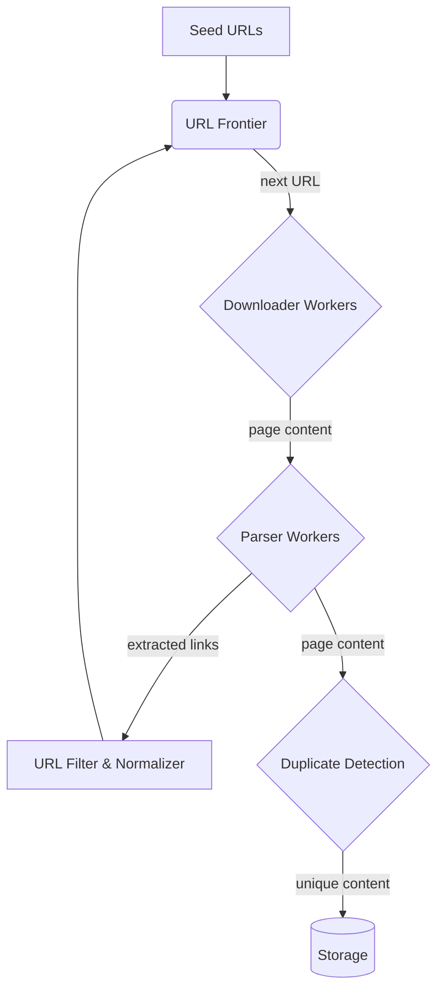

# 5.1.2 Designing a Web Crawler

A web crawler (also known as a spider or bot) is an internet bot that systematically browses the World Wide Web. It's a core component of search engines, used for the purpose of web indexing. This case study outlines the design of a large-scale, distributed web crawler.

## 1. Requirements

### Functional Requirements:
1.  Given a set of starting "seed" URLs, crawl the web from these starting points.
2.  Download the content of the web pages.
3.  Extract all links from the downloaded pages.
4.  Add the newly found links to a list of URLs to be crawled in the future.
5.  Store the content of the crawled pages for later processing (e.g., by a search indexer).

### Non-Functional Requirements:
*   **Scalability:** The system must be able to crawl billions of web pages.
*   **Robustness:** The crawler must be resilient to network errors, server errors, unresponsive servers, and malformed HTML.
*   **Politeness:** The crawler must not overload the servers it is visiting. It should respect `robots.txt` and limit the rate of requests to any single host.
*   **Extensibility:** The system should be extensible to support different content types and protocols.

## 2. High-Level Architecture

A web crawler can be designed as a distributed pipeline of services that work together asynchronously.

## 3. Detailed Component Design

### 3.1 URL Frontier

The URL Frontier is the heart of the crawler. It's a large-scale data structure that manages all the URLs the crawler intends to visit.

*   **Responsibilities:**
    *   Stores all URLs that are waiting to be crawled.
    *   **Prioritization:** Decides which URL to crawl next. This is a complex topic. Priority could be based on PageRank, update frequency, or other heuristics. A simple approach is FIFO (First-In, First-Out).
    *   **Politeness:** Ensures that the crawler doesn't hit the same web server too frequently. It maintains a mapping of hosts to the last time they were accessed and enforces a delay (e.g., a few seconds) between requests to the same host.
    *   **Concurrency:** Must handle being accessed by thousands of downloader workers simultaneously.

### 3.2 Downloader Modules

These are worker services responsible for fetching web pages.

1.  A downloader worker requests a URL from the URL Frontier.
2.  **DNS Resolution:** It resolves the domain name to an IP address. This is a crucial step, and using a caching DNS resolver is important for performance.
3.  **`robots.txt` Check:** Before fetching the page, the downloader must fetch and parse the `robots.txt` file for the host. This file specifies which paths the website owner does not want bots to access. The crawler **must** respect these rules. These rules should be cached for a period (e.g., 24 hours).
4.  **HTTP Request:** The worker makes an HTTP GET request to download the page content. It must be prepared to handle various issues like network timeouts, server errors (5xx), and redirects (3xx).

### 3.3 Parser Modules

These workers take the raw HTML content downloaded by the Downloader.

*   **Link Extraction:** The primary job is to parse the HTML and extract all hyperlink URLs from `<a>` tags.
*   **Content Extraction:** It also extracts the main text content, title, and other metadata from the page.

### 3.4 URL Filter & Normalizer

The links extracted by the parser need to be processed before being added to the frontier.

*   **Filtering:** Discard links that are not of interest (e.g., `mailto:`, `ftp://` links, advertising links).
*   **Normalization:** Convert URLs to a canonical form to avoid crawling the same page multiple times via different URLs. This includes:
    *   Converting the domain to lowercase.
    *   Removing the port if it's the default (e.g., `:80`).
    *   Removing session IDs from the URL.

### 3.5 Duplicate Detection

The web has a massive amount of duplicate content. To save storage and processing time, we need to avoid storing the same page multiple times.

*   **Solution:** Use a hashing algorithm (like MD5 or SHA-256) on the page's content to create a "fingerprint".
*   Before saving a new page, calculate its fingerprint and check if it already exists in a database or a **Bloom filter**. A Bloom filter is a probabilistic data structure that is very space-efficient for checking if an element is part of a set.

### 3.6 Storage

*   **Raw Content:** The raw HTML of the pages is typically stored in a highly scalable blob store like **Amazon S3** or **Google Cloud Storage**.
*   **Parsed Content & Metadata:** The extracted text, links, and other metadata can be stored in a NoSQL database like **Cassandra** or **Bigtable**.

## 4. Further Considerations

*   **JavaScript-heavy Sites:** Many modern websites are Single Page Applications (SPAs) that render content using JavaScript. A simple HTTP downloader will only see the initial empty HTML. To crawl these sites, the downloader modules would need to use a **headless browser** (like Puppeteer or Playwright) to fully render the page, execute the JavaScript, and then extract the content. This is significantly more resource-intensive.
*   **Continuous Crawling:** The web is constantly changing. The crawler needs a strategy to re-crawl pages to detect updates. The URL Frontier can re-add URLs to the queue based on their update frequency (e.g., news sites every hour, personal blogs every few weeks).
*   **Crawler Traps:** Malicious websites can create an infinite number of pages to trap a crawler. The frontier needs to have heuristics to detect and avoid these (e.g., by limiting the crawl depth on a single domain).
