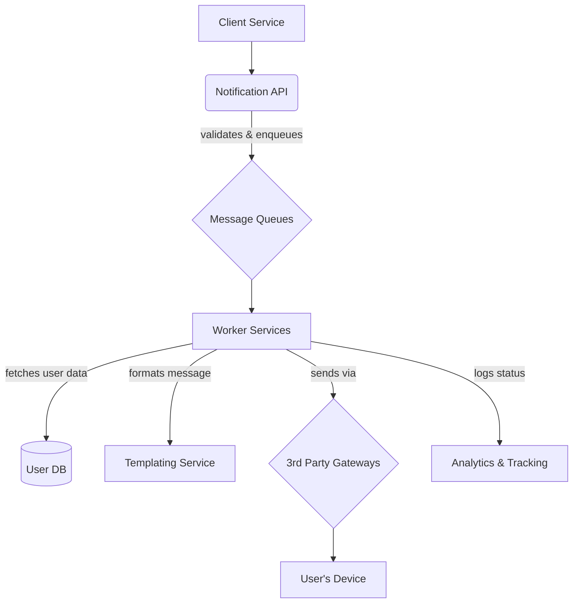

# 5.1.3 Designing a Notification Service

A notification service is a backend system responsible for sending communications to users across various channels, such as push notifications, SMS messages, and emails. It's a common component in most modern applications, used for everything from marketing campaigns to critical account alerts.

## 1. Requirements

### Functional Requirements:
1.  Ability to send notifications to a specific user or a group of users.
2.  Support for multiple channels: Mobile Push (iOS & Android), SMS, and Email.
3.  Support for both immediate (transactional) and scheduled notifications.
4.  Ability to track the status of a notification (e.g., sent, delivered, failed).

### Non-Functional Requirements:
*   **High Reliability:** The system must ensure notifications are delivered, even if downstream services fail. "At-least-once" delivery is a minimum requirement.
*   **High Throughput & Low Latency:** The system must be able to handle a high volume of notification requests with minimal delay.
*   **Scalability:** The architecture must be able to scale to handle millions of notifications per day.
*   **Extensibility:** It should be easy to add new notification channels (e.g., WhatsApp, Slack) in the future.

## 2. High-Level Architecture

The core principle is to use a message queue to decouple the initial request from the actual sending logic. This makes the system asynchronous, scalable, and resilient.



## 3. Detailed Component Design

### 3.1 Notification Service API

This is the single entry point for all other internal services that want to send a notification.
*   **Endpoint:** `POST /api/v1/send`
*   **Request Body:**
    ```json
    {
      "user_id": "user-123",
      "channel": "PUSH", // or SMS, EMAIL
      "template_id": "welcome_message_v1",
      "data": { "name": "Simanta" } // Data to populate the template
    }
    ```
*   **Responsibilities:**
    1.  Validate the incoming request.
    2.  Perform basic authentication/authorization.
    3.  Construct a notification message object.
    4.  Publish the message to the appropriate **message queue**.
    5.  Immediately return a `202 Accepted` response to the caller. This quick response is crucial for an asynchronous design.

### 3.2 Message Queues

Using message queues (like RabbitMQ, Kafka, or AWS SQS) is essential for decoupling and reliability.
*   **Decoupling:** The API service doesn't need to know how a push notification is sent; it just needs to put it in the right queue.
*   **Buffering:** Smooths out bursts of traffic. If a million notifications need to be sent at once, the queue can absorb them, and the workers can process them at a steady rate.
*   **Strategy:** It's common to have separate queues for different channels (`push_queue`, `sms_queue`, `email_queue`) or even different priorities (`high_priority_transactional_queue`, `low_priority_marketing_queue`).

### 3.3 Worker Services

These are fleets of independent services that do the actual work of sending notifications.
*   **Responsibilities:**
    1.  Consume messages from their designated queue.
    2.  Fetch additional user data if needed (e.g., get the user's device token or phone number from a User Service).
    3.  Fetch the correct message template from a **Templating Service**.
    4.  Format the final notification content by merging the template with the data from the message.
    5.  Send the notification by calling the appropriate **3rd Party Gateway**.
    6.  Log the result of the send attempt (success, failure) to an analytics service.

### 3.4 3rd Party Gateways

We don't build the infrastructure to deliver push notifications or SMS messages ourselves. We integrate with specialized third-party services.
*   **Push Notifications:**
    *   **APNs (Apple Push Notification service):** For iOS devices.
    *   **FCM (Firebase Cloud Messaging):** For Android devices.
*   **SMS:** **Twilio**, **Vonage**.
*   **Email:** **SendGrid**, **Mailgun**.

## 4. Key Challenges and Solutions

*   **Reliability & Retries:**
    *   What if a 3rd party gateway (like APNs) is temporarily down? The worker must not drop the notification.
    *   **Solution:** Implement a retry mechanism with **exponential backoff**. If a send fails, the worker requeues the message to be tried again later, with an increasing delay between attempts. After a certain number of failures, the message can be moved to a **Dead-Letter Queue (DLQ)** for manual inspection by an engineer.
*   **Idempotency:**
    *   What if the same notification request is sent twice due to a network glitch? We must not send two identical notifications to the user.
    *   **Solution:** The initial request to the Notification API should include a unique idempotency key. The API service can use a cache (like Redis) to keep track of recently processed keys and reject any duplicates.
*   **User Preferences:**
    *   Users must be able to opt out of certain types of notifications.
    *   **Solution:** Before sending any notification, the worker must query a `UserPreferences` service or table to check if the user has enabled notifications for that specific channel and type.
*   **Throttling:**
    *   Most 3rd party gateways impose rate limits.
    *   **Solution:** The worker services must be designed to respect these rate limits, throttling their send rate if they receive `429 Too Many Requests` errors from the gateway.

## 5. Database Schema (Simplified)

*   **`notifications`:**
    *   `notification_id` (PK)
    *   `user_id`
    *   `channel` (ENUM: PUSH, SMS, EMAIL)
    *   `status` (ENUM: PENDING, SENT, DELIVERED, FAILED)
    *   `content` (JSON or TEXT)
    *   `created_at`, `updated_at`
*   **`user_contact_details`:**
    *   `user_id` (PK)
    *   `device_token`
    *   `phone_number`
    *   `email_address`
*   **`user_preferences`:**
    *   `user_id` (PK)
    *   `channel`
    *   `notification_type` (e.g., 'marketing', 'transactional')
    *   `is_enabled` (boolean)
