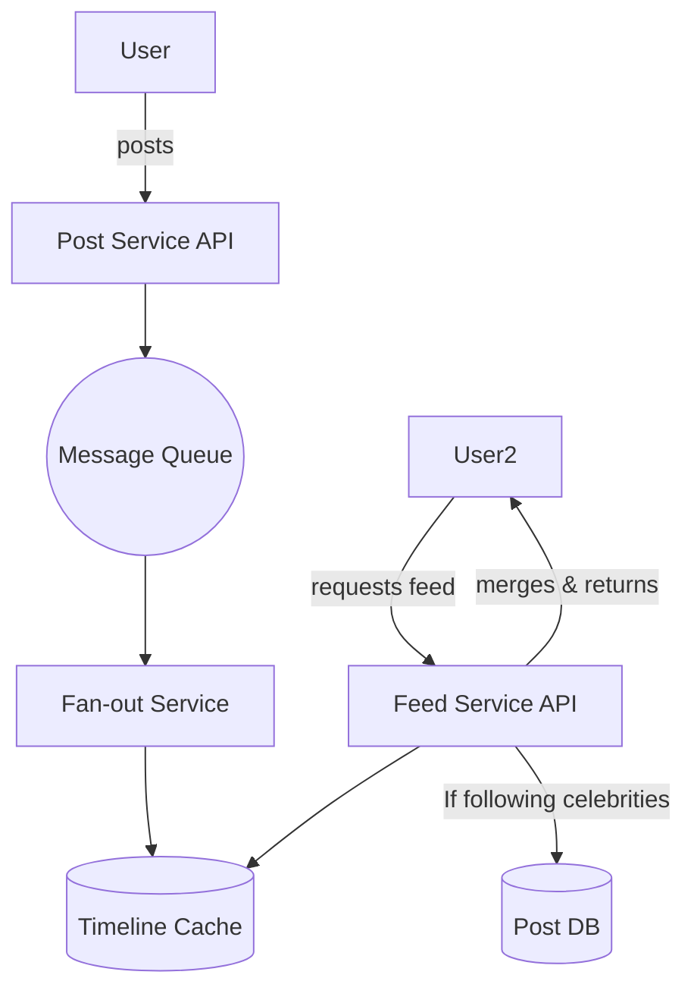

# 5.1.4 Designing a News Feed System

A news feed system, like the timelines on Facebook, X (Twitter), or Instagram, is a core feature of many social media applications. It displays a constantly updated list of content (posts, photos, etc.) from other users or pages that a user follows. This case study explores the design of a scalable news feed.

## 1. Requirements

### Functional Requirements:
1.  A user's news feed should contain posts from the people/pages they follow.
2.  The posts should be sorted in reverse chronological order.
3.  Users can create new posts.
4.  Users can follow and unfollow other users.

### Non-Functional Requirements:
*   **Low Latency:** Generating and retrieving a user's feed should be very fast (e.g., under 200ms).
*   **High Availability:** The feed must always be available.
*   **Eventual Consistency:** It's acceptable if a new post takes a few seconds to appear on all followers' feeds.

### Scale:
*   The system is read-heavy. A user reads their feed much more often than they post. Assume a read-to-write ratio of 100:1 or higher.

## 2. Feed Generation Approaches

The core challenge is how to generate the feed for a user efficiently. There are two primary approaches.

### Approach 1: The "Pull" Model (On-the-fly Generation)

This is the simplest, most intuitive approach.

*   **How it works:** When a user requests their news feed:
    1.  The system finds the list of all users they follow.
    2.  It queries the database to get the most recent posts from each of those users.
    3.  It merges all these posts together and sorts them by their creation timestamp.
*   **Pros:**
    *   Simple to implement.
    *   When a user follows someone new, their posts appear in the feed immediately.
*   **Cons:**
    *   **Very Slow for Reads:** This approach is extremely inefficient for read-heavy systems. For a user following 500 people, this would require 500 separate database lookups, followed by a large in-memory sort, all while the user is waiting.
    *   **The "Celebrity Problem":** Fails completely for users who follow many people. It also struggles when a "celebrity" (a user with millions of followers) posts something, as many users will be trying to pull from them at once.

### Approach 2: The "Push" Model (Pre-computed Feeds)

This approach optimizes for fast reads by doing more work on writes.

*   **How it works:** When a user creates a new post, a "fan-out" process immediately pushes that post into the pre-computed timelines of all their followers.
*   **Write Path (Fan-out on Write):**
    1.  User A creates a new post.
    2.  The system retrieves the list of all of User A's followers.
    3.  It then iterates through this list and injects the new `post_id` into a cached timeline for each follower. This timeline is often stored in a distributed cache like **Redis**, using a list data structure.
*   **Read Path:**
    1.  When a user requests their feed, the system simply reads the list of `post_id`s from their cached timeline (e.g., `GET user_timeline:123`). This is an extremely fast, single-operation read.
    2.  The application then "hydrates" these IDs by fetching the full post content from another cache or database.
*   **Pros:**
    *   **Extremely Fast Reads:** Feed generation is lightning-fast as the heavy lifting has already been done.
*   **Cons:**
    *   **The "Celebrity Problem" (on Write):** If a celebrity with 20 million followers creates a post, the system must perform 20 million writes to update the timelines of all their followers. This fan-out process can be very slow and resource-intensive.

## 3. A Hybrid Approach (The Best of Both Worlds)

The most effective solution, used by companies like Facebook and X, is a hybrid approach that combines the push and pull models.

1.  **For most users (non-celebrities):** Use the **Push Model**. When they post, fan out the post to their followers' cached timelines. This is efficient for users with a few hundred or thousand followers.
2.  **For "celebrities" (users with a very high number of followers):** Do **not** use the push model. Their posts are not fanned out on write.
3.  **Feed Generation Logic:** When a user requests their feed, the system:
    *   **a.** Fetches the user's pre-computed timeline from the Redis cache (this contains posts from all the non-celebrities they follow).
    *   **b.** Separately, identifies any celebrities the user follows.
    *   **c.** Fetches the most recent posts directly from those celebrities (the "pull" model).
    *   **d.** Merges the two lists of posts in the application logic and presents the final, sorted feed to the user.

This hybrid approach ensures fast reads for the majority of content while preventing the massive fan-out problem associated with celebrity users.

## 4. System Architecture

*   **Post Service:** Handles new post creation. When a post is created, it's saved to a primary database and a message is published to a message queue.
*   **Fan-out Service:** An asynchronous worker service that consumes messages from the queue. It checks if the author is a celebrity. If not, it performs the fan-out logic, updating the Redis timelines for all followers.
*   **Feed Generation Service:** Handles user requests for their feed, implementing the hybrid logic described above.
*   **Distributed Cache (Redis):** Essential for storing the pre-computed timelines. The `LPUSH` and `LTRIM` commands in Redis are perfect for maintaining a list of fixed size.

## 5. Further Considerations

*   **The "Diamond" Problem:** If you follow two users (B and C) and they both share a post from a third user (D), you might see the same post twice. The application logic needs to de-duplicate posts before rendering the feed.
*   **Ranking:** Real-world feeds are not purely reverse-chronological. They are ranked by a relevance algorithm (e.g., using machine learning) to show users more engaging content. This ranking can happen during the feed generation step.
*   **Media and Links:** Posts containing images, videos, or links require additional processing to fetch metadata (like thumbnails and page titles), which should be handled by asynchronous workers.
