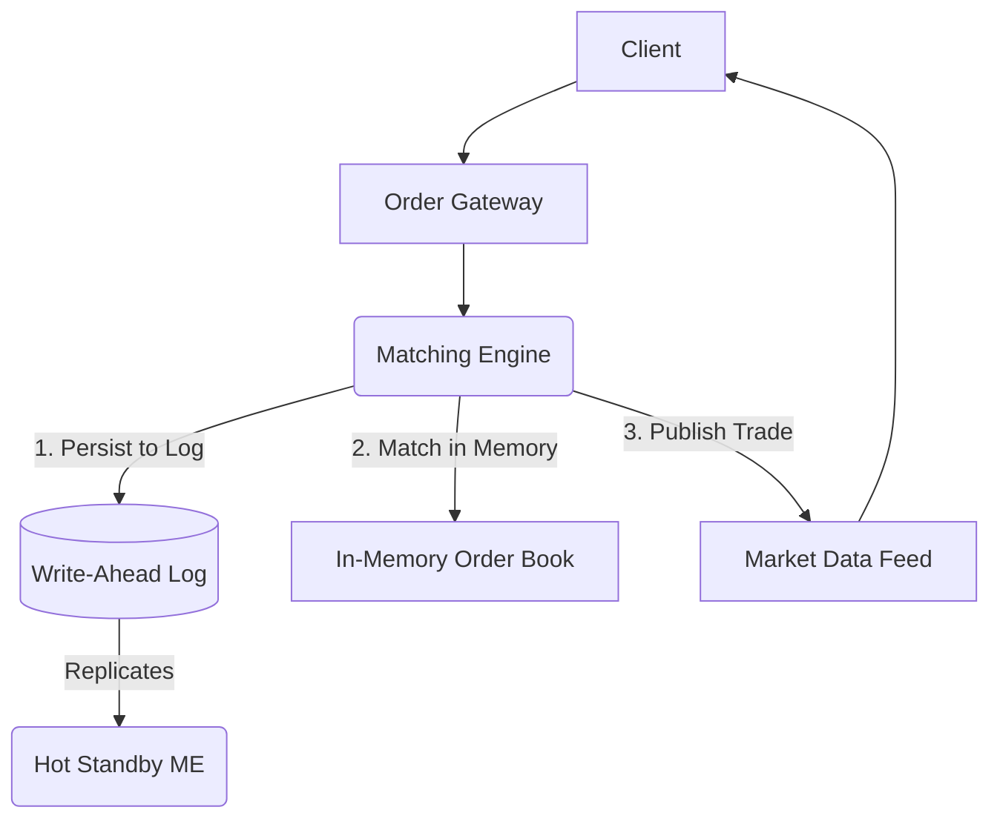

# 5.1.5 Designing a Stock Exchange

A stock exchange is a marketplace where securities like stocks and bonds are bought and sold. Designing the core of a stock exchange—the **matching engine**—is a fascinating system design problem that pushes the limits of latency, throughput, and reliability.

## 1. Requirements

The primary function of an exchange is to match buy orders with sell orders for a particular security.

### Functional Requirements:
1.  Ability to accept buy and sell orders from clients.
2.  Support for different order types, primarily:
    *   **Market Order:** An order to buy or sell immediately at the best available price.
    *   **Limit Order:** An order to buy or sell at a specific price or better.
3.  Orders must be matched according to a deterministic set of rules, typically **Price-Time Priority**.

### Non-Functional Requirements:
*   **Extreme Low Latency:** Matching must be incredibly fast, often measured in microseconds or even nanoseconds.
*   **High Throughput:** The system must handle a massive volume of orders, potentially millions per second during peak times.
*   **Extreme Reliability & Fault Tolerance:** The system cannot lose a single order or trade. It must be designed for 100% uptime during trading hours.
*   **Strong Consistency:** The state of the order book must be perfectly consistent. There is no room for eventual consistency.

## 2. The Core Component: The Matching Engine

The heart of the exchange is the matching engine. It's a program that maintains an **order book** for each security and executes trades.

*   **The Order Book:** An order book is essentially two sorted lists for a single stock (e.g., AAPL):
    *   **Buy Orders (Bids):** A list of all open buy orders, sorted with the **highest price first**.
    *   **Sell Orders (Asks):** A list of all open sell orders, sorted with the **lowest price first**.
*   **Price-Time Priority:** This is the golden rule of matching.
    1.  **Price Priority:** The best price gets priority. For buy orders, this is the highest price. For sell orders, this is the lowest price.
    2.  **Time Priority:** If two orders have the same price, the one that was submitted earlier gets priority.

## 3. The Matching Process

When a new order arrives, the matching engine checks if it can be matched with an existing order on the opposite side of the book.

*   **Example 1: A New Buy Order Arrives**
    *   **Order Book (AAPL):** Best Ask is 100 shares at $150.10.
    *   **New Order:** A **buy limit order** for 50 shares at $150.12 arrives.
    *   **Matching:** The buy price ($150.12) is higher than the best ask price ($150.10). A trade is possible! The engine executes a trade for 50 shares at $150.10 (the price of the resting order). The new order is filled, and the sell order is partially filled.
*   **Example 2: A New Sell Order Arrives**
    *   **Order Book (AAPL):** Best Bid is 200 shares at $150.05.
    *   **New Order:** A **sell market order** for 100 shares arrives.
    *   **Matching:** A market order seeks to execute immediately at the best available price. The engine matches it with the best bid. A trade for 100 shares is executed at $150.05.
*   If an incoming order cannot be immediately matched, it is placed in the order book according to price-time priority to await a matching order.

## 4. System Architecture

The architecture of a matching engine is entirely optimized for low latency and reliability.

*   **Order Gateway:** A server that receives orders from clients. It performs initial validation (e.g., checking for valid format, risk checks) and then forwards the order to the correct matching engine via a very low-latency network connection.
*   **Matching Engine:**
    *   **Single-Threaded & In-Memory:** To achieve the lowest possible latency, the core matching logic for a single security is almost always single-threaded and runs entirely in memory. This avoids the overhead of database calls, network latency, context switching, and multi-threading locks.
    *   **Partitioning:** An exchange runs multiple matching engines in parallel. The order book for each security (or a range of securities) is assigned to a specific engine.
*   **Persistence & Replication (The Key to Reliability):**
    *   The matching engine cannot use a traditional database for its operations because it's too slow. However, it cannot afford to lose any data.
    *   **Write-Ahead Logging (WAL):** Before the matching engine processes any incoming order, it first appends the order to a sequential, on-disk log. This is a very fast operation.
    *   **Replication:** This log is simultaneously replicated to a hot-standby (backup) matching engine.
    *   **Failover:** If the primary matching engine server fails, the standby server, which has received the exact same stream of orders from the log, can take over immediately with an identical order book state.
*   **Market Data Feeds:**
    *   After a trade is executed, or whenever the order book is updated, the matching engine publishes this information (e.g., "Trade executed for AAPL at $150.08") to a market data feed.
    *   This is a high-throughput pub/sub system that broadcasts this data to all clients who are listening.

## 5. Why Not a Traditional Database?

A traditional relational database is fundamentally unsuited for a matching engine because:
*   **Disk I/O:** Database transactions involve writing to disk, which is orders of magnitude slower than operating in memory.
*   **Network Latency:** Communicating with a separate database server adds network latency.
*   **Locking Overhead:** The locking required to maintain ACID compliance in a database would create massive contention and destroy performance.

The entire active state of the order book must live in RAM, with durability and fault tolerance provided by logging and replication.
