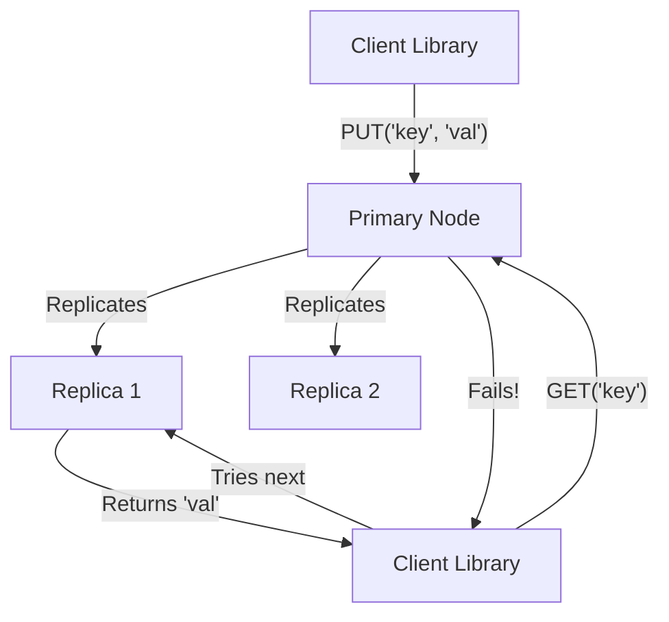

# 5.1.6 Designing a Distributed Cache

A distributed cache is a cache that is shared by multiple application servers. It pools the RAM of multiple servers into a single, unified caching layer, providing high scalability and availability. This case study explores the internal design of a distributed cache system like Memcached or Redis Cluster.

For an overview of caching strategies, see **[2.2 Caching](./../2.0_Backend_System_Design_Concepts/2.2_Caching.md)**.

## 1. Requirements

### Functional Requirements:
1.  `GET (key)`: Retrieve the value for a given key.
2.  `PUT (key, value, ttl)`: Store a key-value pair with an optional Time-To-Live (TTL).
3.  `DELETE (key)`: Remove a key-value pair.

### Non-Functional Requirements:
*   **Low Latency:** Operations must be very fast (sub-millisecond).
*   **Scalability:** The cache should be able to scale horizontally by adding more servers.
*   **High Availability:** The failure of some cache nodes should not bring down the entire system.
*   **Eventual Consistency:** Strong consistency is not typically required.

## 2. Core Challenge: Data Distribution

How do you decide which of the N cache servers should store a particular key? This is the central problem. The solution is **Consistent Hashing**.

*   **Consistent Hashing:** As detailed in **[2.9 Consistent Hashing](./../2.0_Backend_System_Design_Concepts/2.9_Consistent_Hashing.md)**, this algorithm maps all cache servers and all keys onto a virtual "hash ring".
*   **How it Works:** To determine which server a key belongs to, you hash the key to find its position on the ring and then find the first server in the clockwise direction.
*   **Key Benefit:** When a server is added or removed, only a small fraction of the keys need to be remapped, which minimizes data movement and avoids overwhelming the origin servers.

## 3. System Architecture

A distributed cache system consists of two main parts: the cluster of cache servers and a smart client library.

```mermaid
graph TD
    App1[App Server 1] --> CL1[Client Library];
    App2[App Server 2] --> CL2[Client Library];

    subgraph Cache Cluster
        direction LR
        N1[Node 1]
        N2[Node 2]
        N3[Node 3]
        N4[Node 4]
    end

    CL1 -- GET('key') -> N3;
    CL2 -- PUT('key2') -> N1;
```

### 3.1 Cache Server (Node)

*   Each cache server is a simple process that runs an **in-memory key-value store** (e.g., a hash map).
*   It exposes a simple API over TCP for `GET`, `PUT`, and `DELETE` operations.
*   It is responsible for managing its own memory and evicting items when it's full (using an LRU policy).
*   It handles TTLs by having a background process that periodically scans for and removes expired keys.

### 3.2 Client Library

The "intelligence" of the distributed cache lies within the client library that application developers use.

*   **Responsibilities:**
    1.  **Cluster Membership:** The client library maintains a list of all available cache servers in the cluster.
    2.  **Hashing Logic:** It implements the consistent hashing algorithm.
    3.  **Request Routing:** When an application calls `GET('my_key')`, the client library performs the following steps:
        *   Hashes `'my_key'` to find its position on the ring.
        *   Determines which server is responsible for that position.
        *   Opens a direct network connection to that specific server and sends the request.

This design means there is no single "master" node or proxy. The clients are smart and know exactly which server to talk to, which makes the system highly efficient and scalable.

## 4. Service Discovery & Cluster Membership

How does the client library get the list of available cache servers?

*   **Static Configuration:** The list of server IP addresses is simply placed in a configuration file that the client library reads on startup. This is simple but not dynamic.
*   **Dynamic Service Discovery:** A more robust solution uses a service like **Zookeeper**, **Etcd**, or **Consul**.
    1.  Each cache server registers itself with the discovery service when it starts up.
    2.  The client library subscribes to the discovery service to get the current list of active cache servers.
    3.  When a server is added or removed, the discovery service notifies all client libraries, which can then update their hash rings.

## 5. Replication and Fault Tolerance

What happens if a cache node fails? All the data stored on it becomes unavailable.

*   **Solution: Replication.** To prevent data loss, you can configure the system to store a copy of each piece of data on one or more replica nodes.
*   **How it works:**
    *   **Writes:** When the client library performs a `PUT` operation, it writes the data to the primary node (as determined by the hash ring) and also to one or more replica nodes (e.g., the next N servers on the ring). This can be done synchronously or asynchronously.
    *   **Reads:** When performing a `GET`, the client first tries the primary node. If that request fails or times out, it can then try to read the data from the replica nodes.



## 6. Why not just use Redis or Memcached?

This case study describes the internal design of systems like Redis Cluster or a cluster of Memcached servers. Off-the-shelf solutions like these have already solved these complex distributed systems problems (consistent hashing, service discovery, replication) for you. Understanding these internal concepts helps you use those tools more effectively and appreciate the complexity they manage.
