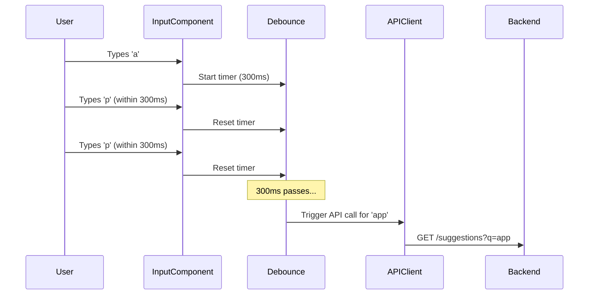
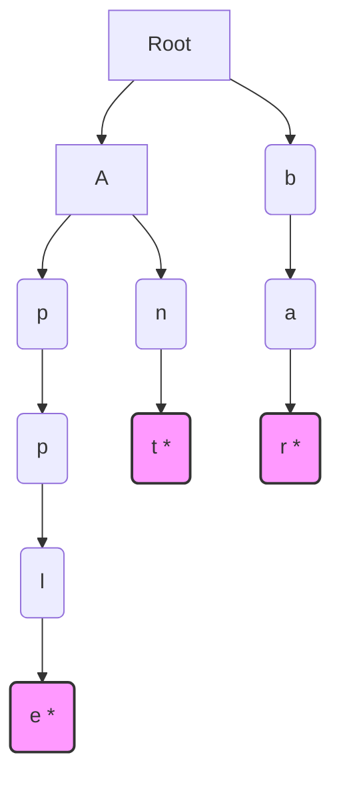

# 5.2.1 Designing a Typeahead Suggestion (Autocomplete)

A typeahead or autocomplete feature is a common UI element that predicts and suggests a list of options as a user types into an input field. This case study covers the design of a scalable and responsive typeahead service, from the frontend interactions to the backend data retrieval.

## 1. Requirements

### Functional Requirements:
*   As a user types into a search box, a list of relevant suggestions should be displayed.
*   The suggestions should be ordered by relevance (e.g., popularity).
*   The user should be able to select a suggestion.

### Non-Functional Requirements:
*   **Low Latency:** The suggestions must appear very quickly (e.g., under 100ms) to feel responsive.
*   **High Availability:** The service must be reliable.
*   **Scalability:** The system should be able to handle a large number of users and a large dataset of possible suggestions.

## 2. Frontend Design

The frontend is responsible for capturing user input, managing API requests, and rendering the suggestions.



*   **UI Component:** A standard text input field that displays a dropdown list of suggestions below it.
*   **Event Handling & Debouncing:**
    *   Listen to the `onChange` event of the input field.
    *   Sending an API request on every single keystroke is inefficient and would overload the backend. A **debounce** function is essential. It ensures that the API call is only made after the user has stopped typing for a certain period (e.g., 200-300ms).
*   **API Client:**
    *   **Request Cancellation:** If the user starts typing again before a request has finished, the previous, now irrelevant, request should be cancelled. The `AbortController` API is used for this.
    *   **Caching:** The client should cache responses for previously seen prefixes (e.g., in an in-memory map). If a user types "appl", then backspaces to "app", the result for "app" can be served directly from the client-side cache.
*   **Rendering:** The component renders the list of suggestions returned from the API, highlighting the matching prefix.

## 3. Backend Design

The backend needs to store the suggestion data and retrieve it with very low latency.

### 3.1 Data Storage and Retrieval

A simple database query with `LIKE 'prefix%'` is too slow for a large-scale system. A specialized data structure is needed. The ideal choice is a **Trie (Prefix Tree)**.

*   **Trie Data Structure:** A Trie is a tree-like data structure where each node represents a character. Paths from the root to a node represent a prefix. This makes it extremely efficient to find all words that start with a given prefix.


*In this Trie, nodes with `*` are "terminal" nodes, indicating the end of a word.*

*   **Retrieval:** To find all suggestions for the prefix "ap", you traverse the Trie from the root (`A` -> `P`). From that node (`P2`), you can then perform a search (e.g., DFS) to find all descendant terminal nodes ("apple").

### 3.2 Ranking/Scoring

Not all suggestions are equal. They should be ranked by relevance.

*   **Frequency/Popularity:** A simple and effective method is to store a frequency count at each terminal node in the Trie. When retrieving suggestions, you sort them by this frequency count.
*   **Updating Frequencies:** The frequency data should be updated periodically (e.g., in a batch process) based on historical search query data.

### 3.3 API Endpoint

*   A simple API endpoint is sufficient: `GET /api/suggestions?q={prefix}`.
*   The backend service takes the `q` parameter, searches the Trie for matching suggestions, ranks them, and returns the top N results (e.g., top 10).

## 4. Scaling the System

*   **Storing the Trie:** For millions of search terms, the Trie can become very large and may not fit in the memory of a single machine.
*   **Distributed Trie (Sharding):** The Trie can be sharded across multiple servers. A common sharding strategy is to partition by the first character of the search term. For example, Server 1 handles prefixes 'a'-'c', Server 2 handles 'd'-'f', and so on. A load balancer or API gateway would route the request to the correct shard.
*   **Using a Dedicated Search Engine:** For very large-scale systems, building and managing a distributed Trie can be complex. A more practical approach is to use a dedicated search engine like **Elasticsearch** or **OpenSearch**. These tools have built-in, highly optimized features for autocomplete (like `completion suggesters`) and are designed to be distributed and scalable from the ground up.
*   **Caching:**
    *   **CDN:** The API responses can be cached at the CDN level for popular prefixes.
    *   **Distributed Cache (Redis):** A Redis cache can be placed in front of the search service to cache results for hot prefixes.

## 5. End-to-End Architecture

```mermaid
graph TD
            User -- types in --> Browser[Input Field];
            Browser -- Debounced Request --> CDN;
            CDN -- Cache Miss --> LB[API Gateway / LB];
            LB -- Route based on prefix --> Shard1[Typeahead Service Shard 1];
            LB -- Route based on prefix --> Shard2[Typeahead Service Shard 2];
            Shard1 --> Trie1[In-Memory Trie / Elasticsearch];
            Shard2 --> Trie2[In-Memory Trie / Elasticsearch];```
