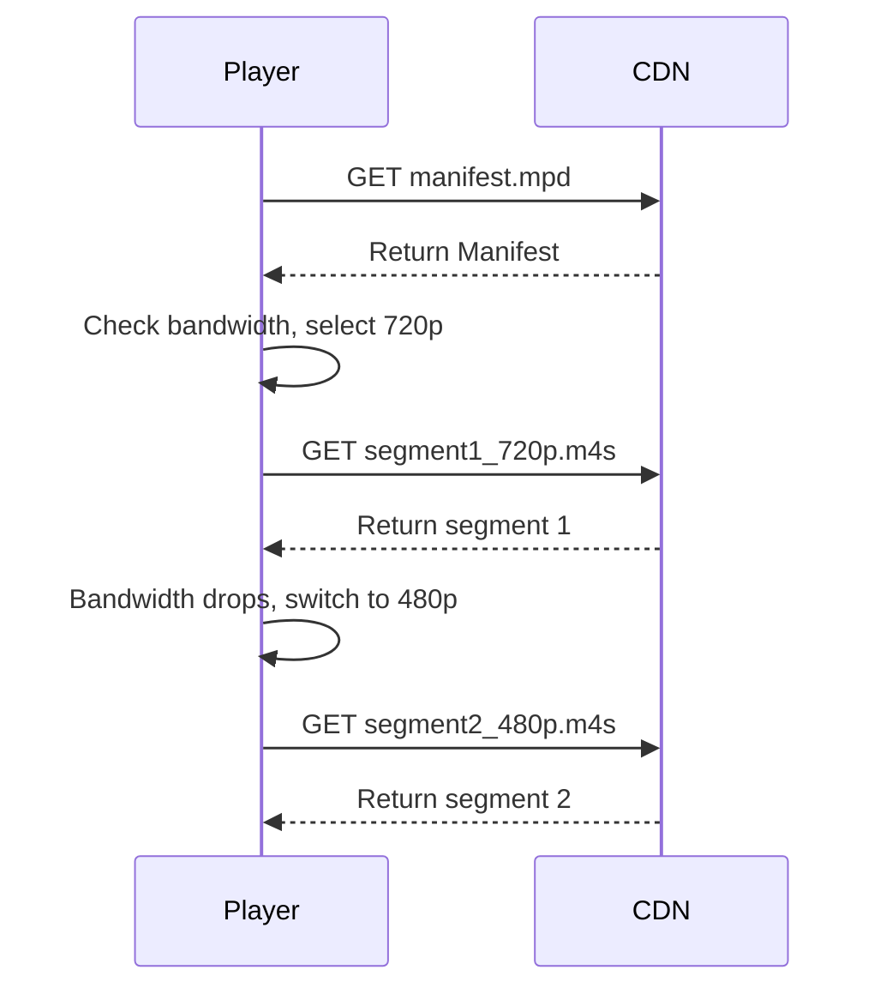

# 5.2.3 Designing a Video Streaming Service Frontend

Designing the frontend for a video streaming service like YouTube or Netflix involves more than just placing a `<video>` tag on a page. It requires a deep understanding of media streaming protocols, performance optimization, and state management to provide a smooth, buffer-free user experience.

## 1. Requirements

### Functional Requirements:
*   Users can browse and search for videos.
*   Users can select a video to play.
*   A video player with custom controls for play/pause, volume, seeking, full-screen, and quality selection.
*   Display video metadata like title, description, and duration.

### Non-Functional Requirements:
*   **Fast Video Start Time:** The video should start playing as quickly as possible.
*   **Minimal Buffering:** Playback should be smooth and uninterrupted.
*   **Responsive Design:** The player and surrounding UI must work on all screen sizes.
*   **Cross-Browser Compatibility.**

## 2. The Core Component: A Custom Video Player

While the HTML5 `<video>` element is the foundation, relying on the browser's default controls is not ideal for a branded, feature-rich experience. Therefore, we need to build a custom player UI.

*   **State Management:** A video player is a stateful component. Key state includes:
    *   `isPlaying`: boolean
    *   `isMuted`: boolean
    *   `isBuffering`: boolean
    *   `currentTime`: number (in seconds)
    *   `duration`: number (in seconds)
    *   `volume`: number (0 to 1)
    *   `activeQualityLevel`: string or number (e.g., '720p')
*   **Event Handling:** The component's logic is driven by listening to events from the underlying `<video>` element:
    *   `onPlay`, `onPause`: To update the play/pause button UI.
    *   `onTimeUpdate`: To update the progress bar.
    *   `onDurationChange`: To get the total duration of the video.
    *   `onProgress`: To show how much of the video has been buffered.
    *   `onWaiting`: To show a buffering spinner.
    *   `onCanPlay`: To hide the buffering spinner.

## 3. Adaptive Bitrate Streaming (ABS)

This is the most critical technology for providing a smooth streaming experience to users on varying network conditions.

**The Problem:** If you serve a single, high-resolution video file, users on slow network connections will experience constant buffering. If you serve a low-resolution file, users on fast connections will have a poor viewing experience.

**The Solution (ABS):**
1.  **Encoding & Segmentation:** The source video is encoded into multiple versions at different bitrates and resolutions (e.g., 360p, 480p, 720p, 1080p). Each version is then split into small segments or chunks, typically 2-10 seconds long.
2.  **Manifest File:** A manifest file is created (e.g., `.m3u8` for HLS, `.mpd` for DASH). This file acts as a playlist, telling the player which quality levels are available and where to find the corresponding video chunks.

**How it Works on the Client:**

1.  The video player first downloads the manifest file.
2.  It continuously monitors the user's available network bandwidth.
3.  Based on the bandwidth, it intelligently requests the highest quality video chunks that it can download in time without causing playback to stall.
4.  If network conditions change (e.g., the user walks into an area with poor reception), the player will seamlessly switch to a lower or higher quality level between chunks.

**Using Libraries:** Implementing this logic from scratch is complex. It's standard practice to use a library like **HLS.js** or **Shaka Player**. These libraries work on top of the standard `<video>` element and handle all the complexities of parsing the manifest, monitoring bandwidth, and fetching the correct segments.

## 4. Performance & User Experience

*   **Fast Start Time:**
    *   Use `preload="metadata"` on the `<video>` tag. This tells the browser to fetch only the video's metadata (like duration), not the video data itself, which allows the player UI to be initialized quickly.
    *   Pre-connect to the media CDN domain using `<link rel="preconnect">` to save time on the initial DNS lookup and connection setup.
*   **Optimizing the Player Bundle:** A feature-rich video player can have a large JavaScript bundle. This should be code-split and loaded asynchronously so that it doesn't slow down the initial page load.
*   **Buffering Indicator:** Always provide clear visual feedback (e.g., a spinner) when the video is buffering.
*   **Remembering User Preferences:** Use `localStorage` to remember the user's preferred volume, muted state, or quality level across sessions.
*   **Poster Image:** Provide a `poster` attribute for the `<video>` tag. This is an image that is displayed before the video starts playing, improving the perceived load time.
