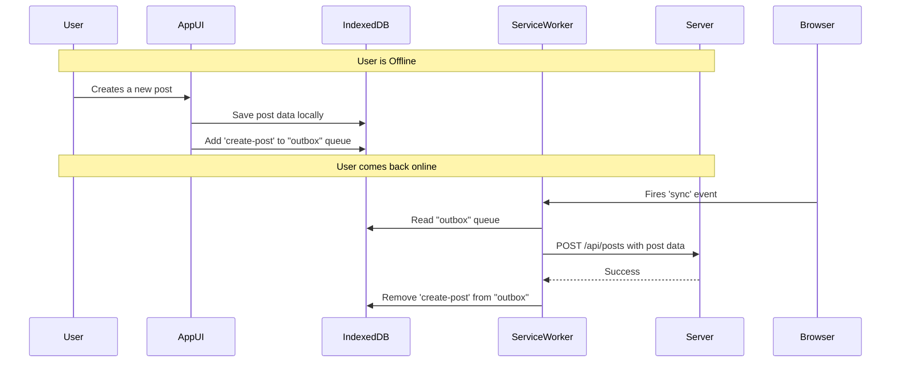
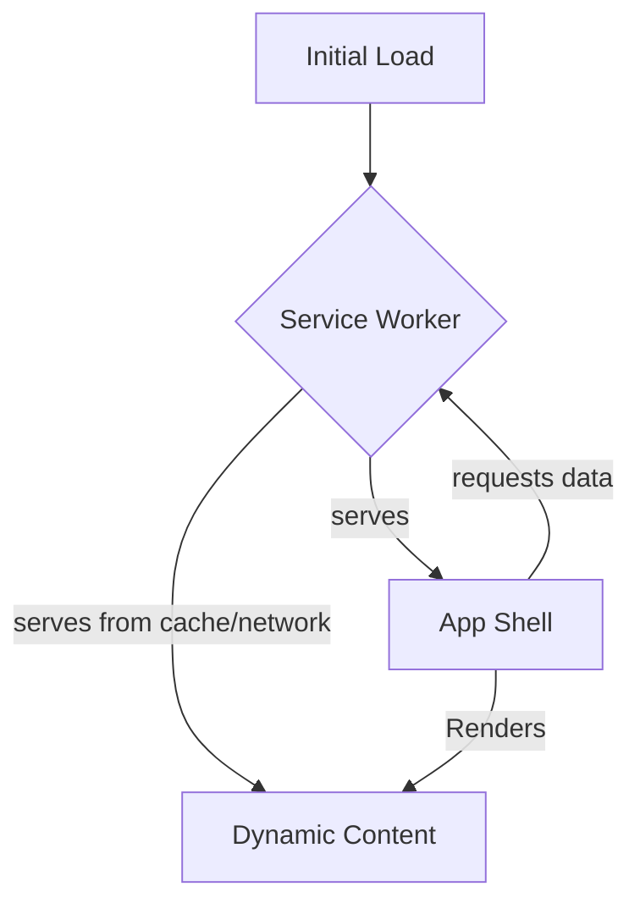

# 5.2.5 Case Study: Designing an Offline-First Application

An offline-first application is designed to provide a high level of functionality regardless of network connectivity. Instead of being a "web page" that breaks without a network, it behaves more like a native application that can read, create, and edit data while offline and then seamlessly synchronize with the server when a connection is available.

## 1. Introduction

**Why build offline-first?**
*   **Reliability:** The application works in areas with poor or intermittent network conditions (e.g., on a subway, at a conference).
*   **Performance:** Loading data from a local cache is almost instant, leading to a much faster perceived performance.
*   **Better User Experience:** Users can continue their work without interruption, and the UI never feels broken or unavailable.

This case study is a practical application of the concepts introduced in **[3.5 Progressive Web Apps (PWA)](./../3.0_Frontend_System_Design_Concepts/3.5_Progressive_Web_Apps_PWA.md)**.

## 2. Core Technologies

The foundation of an offline-first web application rests on two key browser technologies: Service Workers and Client-Side Storage.

### 2.1 Service Workers

The Service Worker acts as a programmable network proxy that sits between your application and the network. It allows you to intercept network requests and decide how to handle them.

*   **Caching Strategies for an Offline App:**
    *   **Cache First (for the App Shell):** The "App Shell" is the minimal HTML, CSS, and JavaScript required for your application's UI. This should be cached aggressively. When a request is made for an App Shell asset, the Service Worker serves it from the cache first. This ensures the UI loads instantly, even offline.
    *   **Stale-While-Revalidate (for dynamic content):** For data that can be slightly out-of-date (e.g., a social media feed), this strategy provides a great balance.
        1.  Serve the data directly from the cache (stale).
        2.  Simultaneously, send a request to the network to get the latest version.
        3.  Update the cache with the new version for the next time the user requests it.
    *   **Network First (for critical, fresh data):** For data that must be up-to-date, try the network first. If the network request fails (i.e., the user is offline), fall back to the version in the cache.

### 2.2 Client-Side Storage

*   **IndexedDB:** A powerful, transactional database built into the browser. It's ideal for storing large amounts of structured data, such as user documents, settings, or a queue of pending changes. Unlike `localStorage`, it's asynchronous (non-blocking) and can handle much more data.
*   **Cache API:** A lower-level API, typically used by the Service Worker, for storing HTTP request/response pairs. This is perfect for caching the App Shell and API responses.

## 3. Handling Data Synchronization

This is the most complex part of an offline-first application: how to handle data that the user creates, updates, or deletes while offline.

1.  **Local Storage of Changes:** When the user is offline and performs a write action (e.g., creates a new document), the application should not show an error. Instead, it should save the new/updated data to **IndexedDB**.
2.  **The "Outbox" Queue:** The application should also maintain a log of these pending changes in a separate IndexedDB store, often called an "outbox". This queue records the actions that need to be sent to the server once connectivity is restored.
3.  **Background Sync API:**
    *   The `BackgroundSync` API is the key to reliable synchronization. When the application saves a change to the outbox, it registers a "sync" event with the Service Worker.
    *   The browser will then automatically trigger this `sync` event in the Service Worker when it detects that the network connection is stable. This can happen even if the user has closed the application tab.
    *   The Service Worker's `sync` event handler reads the pending changes from the outbox in IndexedDB and sends them to the server.
4.  **Conflict Resolution:** A major challenge is handling conflicts. What happens if a user edits a document offline, but someone else had already edited the same document on the server?
    *   **Last Write Wins:** The simplest strategy. The last change to be synchronized overwrites any previous changes. This can lead to data loss.
    *   **Merge Logic:** Implement business logic on the client or server to merge the changes intelligently.
    *   **User-Driven Resolution:** Present the conflict to the user in the UI and ask them to resolve it manually.

## 4. Application Architecture: The "App Shell" Model

*   **App Shell:** The minimal, static UI of your application. This is cached permanently by the Service Worker on the first visit. On subsequent visits, the App Shell loads instantly from the cache, providing a native app-like startup experience.
*   **Dynamic Content:** The actual data. This is fetched by the App Shell's JavaScript, either from the network (via the Service Worker) or from a local database like IndexedDB.
