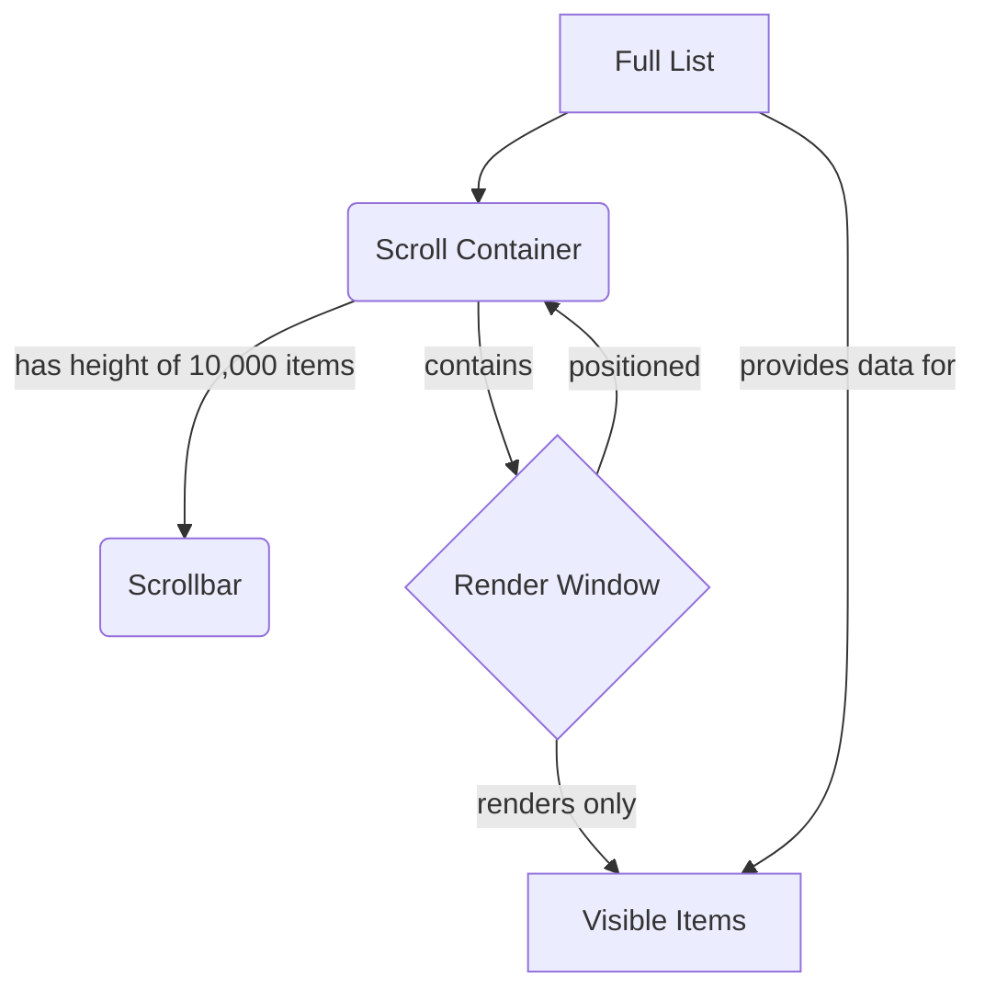

# 5.2.6 Designing an Infinite Scroll & Virtualized List

Displaying long lists of data is a common requirement in web applications, from social media feeds to product catalogs. A naive approach of rendering all items at once leads to severe performance problems. This case study explores two techniques to handle this: **Infinite Scroll** for data loading and **List Virtualization** for efficient rendering.

## 1. The Problem with Long Lists

If you try to render thousands of items directly into the DOM:
*   **High Memory Usage:** The browser has to store all the DOM nodes in memory, which can lead to slowdowns and even crashes.
*   **Slow Initial Render:** Creating thousands of DOM nodes takes a long time, leading to a poor user experience.
*   **Slow Updates:** Any change that causes a re-render becomes extremely slow as the browser has to process the entire list.

## 2. Part 1: Infinite Scroll (Data Loading)

Infinite scroll is a technique where data is loaded continuously from the server as the user scrolls down the page, creating the illusion of an "infinite" list.

### Core Concepts:
*   **Sentinel Element:** A hidden element placed at the bottom of the list of currently rendered items.
*   **Intersection Observer API:** A modern, efficient browser API that allows you to detect when an element enters or leaves the viewport.

### Implementation:
1.  **Initial Data Load:** Fetch the first "page" of data and render the items.
2.  **Place the Sentinel:** Render a "loader" or an empty `
` (the sentinel) at the end of the list.
3.  **Observe the Sentinel:** Use an `IntersectionObserver` to monitor the sentinel element.
4.  **Trigger Data Fetch:** When the observer detects that the sentinel is visible (i.e., the user has scrolled to the bottom), trigger an API call to fetch the next page of data.
5.  **Append Data:** Append the newly fetched items to your list in the application's state, which will cause them to be rendered. The sentinel element is now automatically pushed further down.

This pattern efficiently loads data as needed but does **not** solve the problem of having too many DOM nodes. After a user scrolls for a while, there could still be thousands of items in the DOM.

## 3. Part 2: List Virtualization (Efficient Rendering)

List virtualization (also known as "windowing") is the solution to the DOM performance problem. The core idea is to **only render the items that are currently visible in the viewport**.

### How it Works:

1.  **The Scroll Container:** You create an outer container element. Its height is set to the total height that the *entire* list would occupy if all items were rendered (e.g., `itemCount * averageItemHeight`). This creates a scrollbar that accurately reflects the full length of the list.
2.  **The Render Window:** Inside the scroll container, you create an inner "window" element. This element is positioned absolutely. It will contain the few items that are actually rendered to the DOM.
3.  **Listen to Scroll Events:** Attach an `onScroll` event listener to the scroll container.
4.  **Calculate Visible Items:** On each scroll event, use the `scrollTop` value to calculate which items *should* be visible. For example, if the user has scrolled 3000px down and each item is 30px high, you know they are around item index 100.
5.  **Render and Reposition:**
    *   Update the state to render only the items for the calculated visible range (e.g., items 95 to 115).
    *   Update the `transform: translateY(...)` CSS property of the inner window to move it down into the correct position within the large scroll container.

This ensures that no matter how long the list is, you only ever have a small, constant number of DOM nodes, resulting in a smooth scrolling experience with low memory usage.

## 4. Dynamic Item Heights

The above explanation assumes all items have a fixed, known height. If item heights are dynamic, the process is more complex:
1.  You start by providing an estimated average height for each item to calculate the total scroll height.
2.  After an item is rendered, you measure its actual height using `ResizeObserver` or other methods.
3.  You then cache this real height and use it to update the positions of subsequent items and the total scroll height of the container.

## 5. Use a Library

Implementing a robust and bug-free virtualized list from scratch, especially one that handles dynamic heights, is very challenging. It is highly recommended to use a battle-tested open-source library.

*   **`react-window`:** A lightweight and performant library for fixed-size lists.
*   **`react-virtualized`:** A more feature-rich library that supports dynamic heights and other complex use cases.
*   **TanStack Virtual:** A modern, "headless" virtualization utility that gives you the logic and lets you control the rendering completely.

By combining the **infinite scroll** pattern for data fetching with **list virtualization** for rendering, you can create user interfaces that handle virtually infinite lists of data efficiently and performantly.
