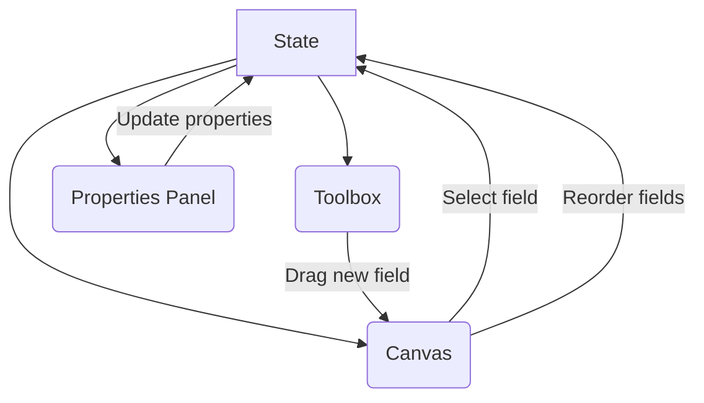

# 5.2.8 Designing a Dynamic Form Builder (Frontend)

A dynamic form builder is a UI that allows users (often non-technical ones) to create custom forms by dragging and dropping different input fields. The system must also be able to take the structure created by the builder and render a live, functional form from it.

## 1. Requirements

### Functional Requirements:
1.  **Builder UI:**
    *   A "toolbox" of available form fields (e.g., Text Input, Textarea, Checkbox, Select, Date Picker).
    *   A "canvas" where users can drag, drop, and reorder fields to design the form layout.
    *   A "properties panel" to configure the selected field (e.g., edit the label, add a placeholder, mark it as required, define options for a dropdown).
2.  **Data Model:** The structure of the created form must be serializable, typically as JSON.
3.  **Renderer UI:** A separate component that can take the JSON form structure and render a live, usable HTML form from it.

### Non-Functional Requirements:
*   **Good User Experience:** The builder should be intuitive and easy to use.
*   **Responsive:** Both the builder and the rendered forms should work on different screen sizes.
*   **Extensible:** It should be easy to add new custom field types to the builder.

## 2. The Core Data Structure: The Form Schema

The entire system revolves around a well-defined JSON structure that represents the form. This schema is the **output** of the builder and the **input** for the renderer.

A simple schema might look like this:
```json
{
  "formId": "frm-123",
  "formName": "User Feedback Survey",
  "fields": [
    {
      "id": "field-abc",
      "type": "text",
      "label": "Your Full Name",
      "placeholder": "Enter your name",
      "required": true
    },
    {
      "id": "field-def",
      "type": "select",
      "label": "Feedback Topic",
      "required": true,
      "options": [
        { "value": "general", "label": "General Feedback" },
        { "value": "bug", "label": "Bug Report" }
      ]
    },
    {
      "id": "field-ghi",
      "type": "textarea",
      "label": "Your Feedback",
      "required": false
    }
  ]
}
```

## 3. The Builder UI: Architecture

The builder is a stateful application where the form schema object is the central piece of state. Every user action is a manipulation of this JSON object.



*   **Component Breakdown:**
    *   `<Toolbox />`: Renders a static list of available field types (e.g., 'text', 'select').
    *   `<Canvas />`: This is the main design area. It renders the form fields based on the current state of the schema. It also acts as the drop target for new fields and allows for reordering existing fields.
    *   `<PropertiesPanel />`: When a field on the canvas is selected, its `id` is stored in the UI state. This component then displays the configuration options for the selected field from the schema, allowing the user to edit its properties (label, required, etc.).
*   **State Management:** A state management library (like Redux, Zustand, or even React Context) is used to hold the form schema. User actions dispatch events that update this central state. For example, dropping a new field adds a new object to the `fields` array.
*   **Drag-and-Drop:**
    *   This is a core interaction. While you can use the native HTML Drag and Drop API, it's often easier to use a dedicated library.
    *   **Libraries:** **`react-dnd`** or **`dnd-kit`** are excellent choices for building complex and accessible drag-and-drop interfaces in React.

## 4. The Renderer UI: Architecture

The renderer's job is much simpler: take a form schema and turn it into a working form.

*   **How it Works:**
    1.  The `<FormRenderer />` component receives the form schema JSON as a prop.
    2.  It iterates (maps) over the `fields` array in the schema.
    3.  For each `field` object in the array, it dynamically renders the appropriate input component based on the `field.type` property.
*   **Dynamic Component Rendering:** A common pattern is to use a component map.

    ```javascript
    import TextInput from './TextInput';
    import SelectInput from './SelectInput';

    const componentMap = {
      text: TextInput,
      select: SelectInput,
      textarea: // ...
    };

    function FormRenderer({ schema }) {
      return schema.fields.map(field => {
        const Component = componentMap[field.type];
        if (!Component) return null;
        // Pass all field properties as props
        return <Component key={field.id} {...field} />;
      });
    }
    ```
*   **Form State and Validation:**
    *   Managing the state of the rendered form's inputs (the actual user-entered values) and handling validation can be complex.
    *   It's highly recommended to use a dedicated form management library like **React Hook Form** or **Formik**.
    *   These libraries can be configured dynamically. You can generate the validation schema (e.g., using `yup` or `zod`) for the library directly from the `required` and other properties in your form schema JSON.

This architecture creates a clean separation of concerns: the **Builder** is a complex application for creating a data structure, and the **Renderer** is a simpler component that declaratively renders a UI based on that data structure.
